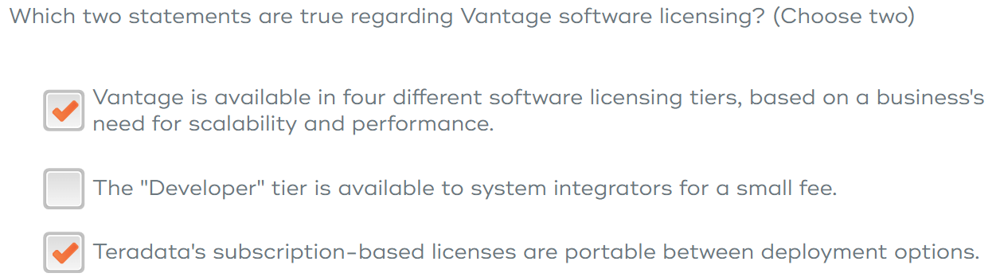
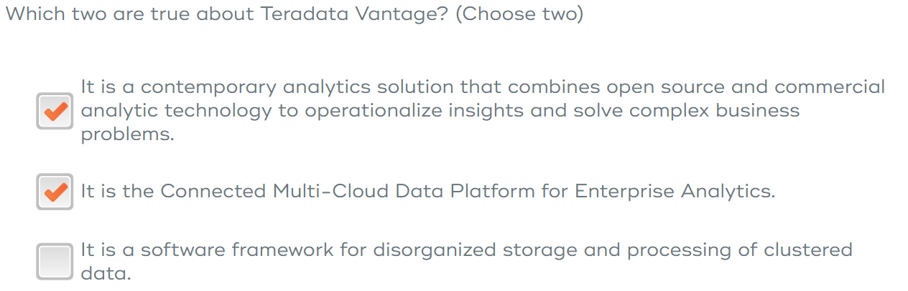
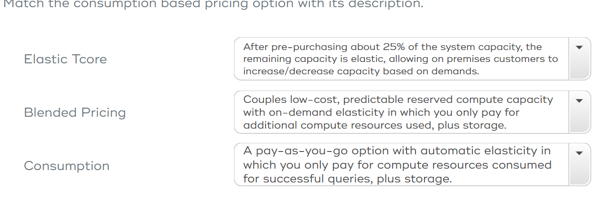
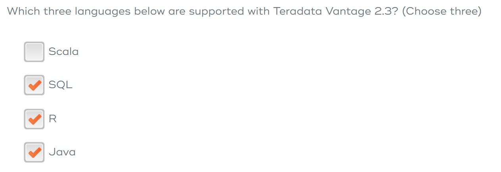
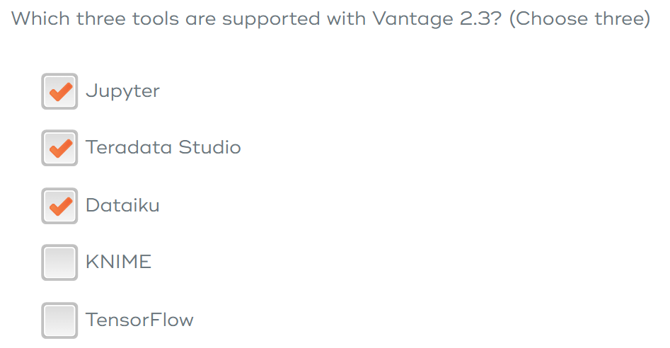
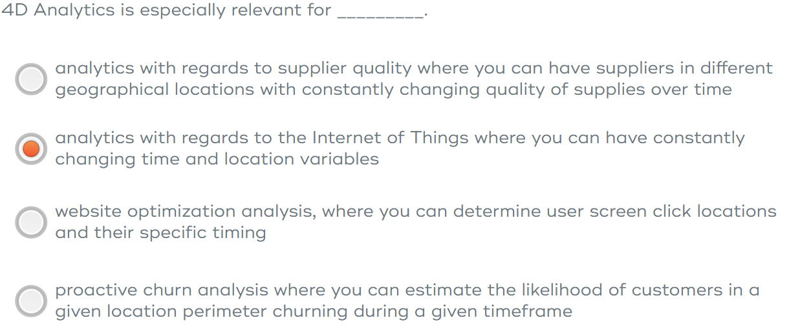
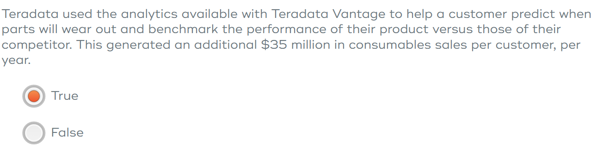

  

 

# **Introduction of Teradata Vantage 2.3**
## Module 1 *What is Teradata Vantage?*
* A platform for all Enterprise Analytics
* Data and analytics are integrated to simplify data access and reduce data movement
* Thus can decreasing the manual data preparation needed.
* Commonly used language and UI are available
* Seamlessly deploy advanced analytic models.

### Data Integration Challenges:
* Data Store
* Native Object Storage
* QueryGrid
* Data Lab

### Some of the important features:
* Bring Your Own Model(BYOM)
  * predictive model trained in external tools can be easily scored using BYOM Predict Function
  * one requirement the model is stored in Vantage table
  
* teradataml
  * similar to Pandas
  * teradataml DataFrame works similar to Pandas
  * has APIs to access or manipulate a teradataml DataFrame
  
* tdplyr
  * similar to R's dplyr package
  * has many verbs that is the same as dplyr
  * with enhanced compatibility
  
* Analytics Library
  * provide over 50 advanced analytic functions built in the Advanced SQL Engine
  * to call a Vantage Analytics Library function, use Teradata Studio or Basic Teradata Query
  * user defined functions(UDFs) must be installed in the Vantage database

### Teradata offers flexibility to different needs and options are:
* Deployment
  * on prem: on Teradata Infrastructure or Commodity VMware
  * Teradata cloud: SaaS on IntelliFlex systems
  * available via public cloud vendors 
  * hybrid cloud solution or multi cloud solution
* Purchasing
  * developer: free tier for non-production environments
  * base: low concurrency entry level DW
  * advanced: high concurrency production mixed workload
  * enterprise: more robust workload and sophisticated performance features
* Licensing
  * future-proofs buying with subscription based license
  * Portable: carry license with users when they move  
* Consumption
  * standard capacity pricing(Elastic TCore)
    * for on-prem with pre-purchasing 25% the rest is elastic
    * a price premium when using extra capacity, but only pay for what is consumed  
  * CaaS pricing
    * Blended Pricing for Vantage: couples low cost predictable reserved compute capacity
    * Consumption Pricing for Vantage: pay as you go
* Analytics Phase
  * descriptive: summarize raw data to report what has happened in the past
  * predictive: analyze past behavior and looking for patterns to predict the likelihood of an event taking place in the future
  * prescriptive: attempts to quantify the effects of a future decision in order to provide advice on the best solution or outcome among various choices

### Public Cloud Scalability Options
#### For Blended Pricing only
* Vantage Stop/Start: stop and restart the instance without affecting persistent storage
* Vantage Scale Out/In: change number of Advanced SQL Engine node instances(out increase, in decrease)
* Vantage Scale Up/Down: change Advanced SQL Engine node instance size 
* Elastic Performance on Demand(EPOD): add additional Vantage Compute capacity without downtime
#### For all Pricing
* Data Store Expansion: Expand storage after deployment in 1TB increments at the system level

## **Module 1 quiz**

***

***

***

***

***

## Module 2 **Business Outcome**
### 4D Analytics
* 3 dimensional: longitude, latitude, elevation 
* plus time
* to provide valuable analytical insights with regards to where and when
* it can be used standalone via Advanced SQL Engine or as the foundation of a multitude od additional advanced analytics

### Native Object Store
* Data Lake: directly access raw data with object stores
* Data Archiving: archive infrequently used data into low cost object store
* Data Sharing: can publish data into object store enable other users to access that store

## **Module 2 quiz**

***

***
## Module 3 **Technology**
### Foundation Components of Vantage is the Advanced SQL Engine with powerful attributes:
* Linear Scalability
* Adaptive Optimizer
* Workload Management

### Traditional Execution Flow
1. run SQL against a data warehouse
2. extract large amount data to a file on local disk
3. access the file from third party softwares
4. deliver an analytical outcome
Step 2 add latency and the processing is done with limited speed.

### Vantage Execution Flow
1. submit a query via a software(Jupyter)
2. API then converts to SQL for execution in Vantage
3. only results are returned to Jupyter
4. deliver an analytical outcome
Step 2 is done in Vantage with parallel systems and large amount of memory. 
Step 3 decrease the latency.

### Open Ecosystem Connectivity with QueryGrid
* minimize data movement and duplication via data federation
* process data where is resides

### Overall image of the components:

* tools are in the turquoise color
  
### First Party Service Integration
* AWS
* Azure
* Google

### Physical view of Vantage
* Advanced SQL Engine Nodes: ensure critical SLAs are not affected by advanced analytic workload
* Data Store: solid state drive 
* Multipurpose Servers: IntelliFlex system

## **Module 3 quiz**

***

  

