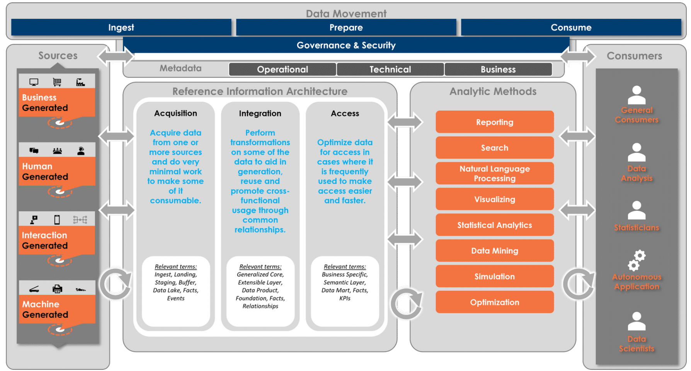
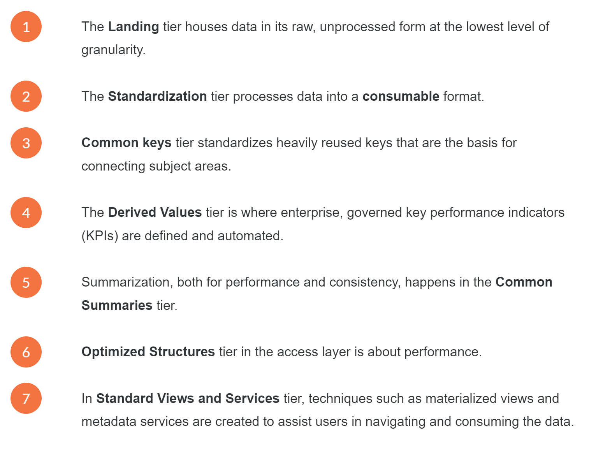
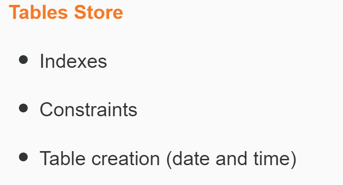
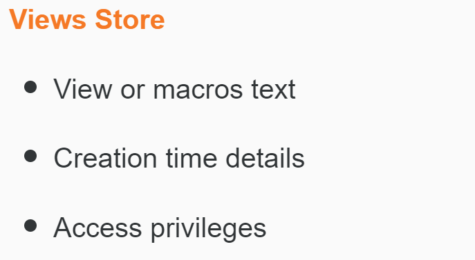
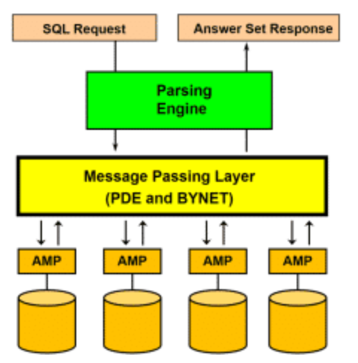
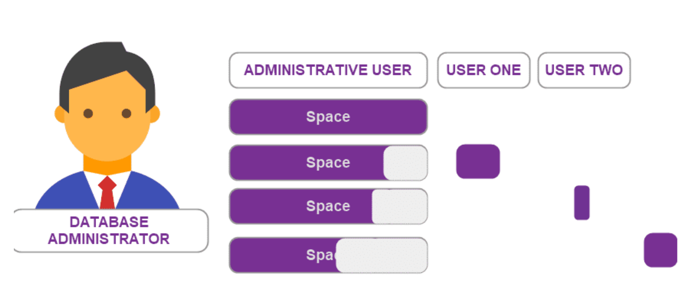
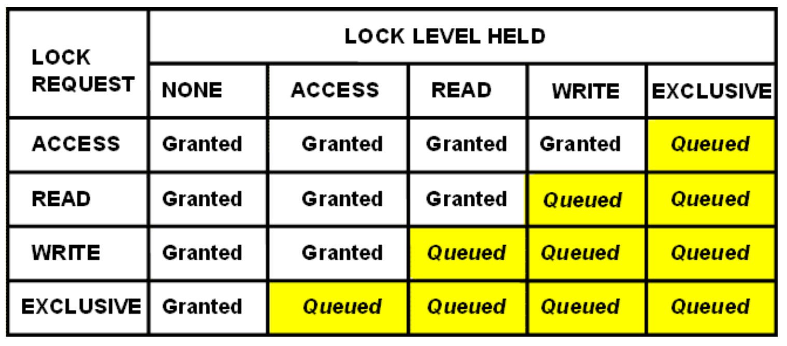
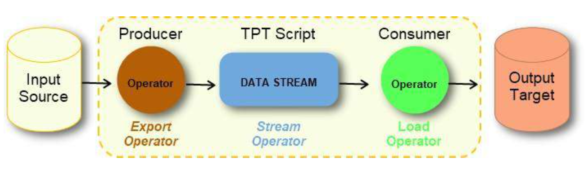

  

 

# **Teradata Advanced SQL Engine 17.10**
## Module 1 *Database Concept*
* database provides an organized mechanism for storing, managing and retrieving data.
* not all database can perform the same actions:
  * **retrieve** all records that match certain criteria
  * **update** records in bulk
  * **cross-reference** records in different tables
  * **perform** complex aggregate calculations

### Common types of Databases
* relational: is structured to recognize connections between stored items of information. SQL
* No-SQL: only to retrieve information
***
## Module 2 *Relational Database*
* based on mathematical set theory
* mathematical concept: relation(table), tuple(row), attribute(column)
* in a table:
  * each record is called row
  * each column is called fields (plural!)
* schema refers to organizing the data as a blueprint that shows how the database is divided into tables
* **Formal definition of a Schema:** a set of formulas or sentences called integrity constraints imposed on a database
* each column in the **entire database** need not be unique
* only columns within a **single table** must be distinct
* primary key: unique identifier for each record or row
* foreign key: a column or group of columns in a relational database table that defines the relationship between the data in two tables.
* when the same primary key (name can be different, but contains the same information) is included in another table, it becomes a foreign key.
* FK must agrees with PK

### Data Modelling
* 3NF: third normal form: rules and guidelines about how the data model should look, which means which columns should belong to which table.
* three types of data models:
  * relational: most common type and reflect business rules
  * dimensional: emphasize usability
    * Normalization
      * is the process of reducing a complex database schema into a simple and stable one. 
      * removing redundant attributes, keys and relationships from the conceptual data model
      * is optimized for entity level transactions
    * Denormalization
      * supports dimensional modelling: speed and simplicity
      * is optimized for answering business questions and driving decision making
    * Fact table: M to M relationship, contains one or more numerical measures that occur for the combination of keys that define each tuple in the table
  * logical: not implemented on hardware, is technology independent
  * physical: technical solution, it is specific to a given database software and hardware
  * logical and physical can be either relational or dimensional
***

## Module 3 *RDBMS*
* relational database management system
* creating and managing databases
* create, retrieve update and manage data
* create reports, enforce database rules/constraints and maintain schema
  
### SQL
* structured query language
* used to create, manage, manipulate and query database objects
***

## Module 4 *Data Warehouse*
* specially constructed data repository where data is organized so that it can be easily accessed by end users for various applications
* common in corporations
* carry many years' worth of detailed data so historical trends can be analyzed
* data warehousing is a process **NOT** a product which manage and assemble data from various sources to answer business questions

### Data Mart
* data warehouse is more like an enterpriser-level
* compare to it, information in data mart pertains to a single department
* Independent Data Mart
  * isolated entities entirely separate from the enterprise data warehouse
  * derived from independent sources 
  * be viewed as data pirates
  * have high likelihood of producing data that does not match that of the warehouse
* Dependent Data Mart
  * derived from enterprise data warehouse
  * might(or not) be useful depending on the configuration
  * permits users to have full access to the enterprise data store
* Logical Data Mart
  * a form of dependent data mart
  * constructed virtually from the physical warehouse
  * data is presented using a series of SQL views

### Analytic Processing
* data warehouse is original defined as a decision support system(DSS)
* OLAP: Online Analytic Processing
  * comprise the complex analysis that are performed on a data set
  * data mining, querying, pivoting, slicing, dicing, drilling, reporting and other decision-support applications
  * a data warehouse can be used without OLAP
* OLTP: Online Transaction Processing
  * manages business applications and collects day to day data
  * different than a data warehouse
  * access small number of records or a few tables

### Data Warehouse Architecture
 
* Acquisition: entry into data warehouse, raw data is acquired
* Integration: responsible for integrating data from multiple systems with common metrics and summaries
* Access: provide easy access to the data using various analytic methods
* Tiers:
 
Not all data tiers are used for every feed coming in from a data source.

### Data Flow
1. Data Warehouse: data is collected and moved to a dedicated server contains a data warehouse
2. Analysis: data can be formatted, validated, recognized, summarized and supplemented
3. data is merged with data from many other sources
4. resulting data warehouse becomes the main source of information for data mining, OLAP, market research, report generation and analysis

### Types of Implementation
* Centralized
  *  useful for small and mid-size data warehouses
  *  a single physical repository
  *  serves separate department within an organization at the same time using a single data model
* Federated
  * share information among a number of different systems
  * master file will be shared and other system can use it
  * can reduce response time
* Data Mart
  * within a single organizational data warehouse repository
  * condensed an focused version of data warehouse dedicated to a specific business need
  * commonly multiple data marts to be used in order to server the needs of each department

### Deployment Options
* no right or wrong answers when choosing if to deploy a data warehouse on-prem or over the cloud
* On-prem
  * buying software and hardware from a data warehousing company
  * gives organization total control
  * most secure
  
* Cloud
  * in public or private cloud
  * trust issue is hard to overcome
  * require high bandwidth
  * private cloud can provide more security
***
## Module 5 *Teradata Advanced SQL Engine Introduction*
* stores current and historical data in one location
* enables effective data analysis and reporting
* a central repository of integrated data
* supports high performance, diverse queries and in-database analytics
* built-in parallelism enables faster processing
  
### Connect to Teradata
* client submit a SQL request to the Teradata Advanced SQL Engine
* the engine also receives response for the user 
* business-led, technology enabled

### Features and Benefits
* single version of business
* high availability
* high scalability
* teradata everywhere
* unlimited parallelism

### Objects with the Engine
* Partitioning: larger tables within a database is divided into smaller tables, can run faster
* tables, views, macros, triggers, stored procedures, and user-defined functions
* partitioned table: set of columns
* set table: no duplicate rows in a table
* secondary index: allows optional ways for the system to access the rows of a table
* stored procedure: a combination of pre defined procedural statements
* join index: enable join queries to be resolved without accessing or joining the actual tables
* user: as a collection of tables, views, macros, triggers, stored procedures, join indices and access right
* data types: specify the type of each values
* view: virtual table, not storing any information
* fallback: protecting the data against AMP failure
* macro: bundles multiple functions together
* trigger: defines a catalyst action and subsequent activities

#### Metadata
* Means of creation of the data
* Purpose of the data
* Time and date of creation along with the creator and author of the data
* Location on a computer network where the data was created
* Standards used and file size

#### Data Dictionary
* owned by the system user DBC
* composed of tables and views
* views provide access to the information in the tables

  
  

 

### Components within the Teradata Advanced SQL Engine
* Virtual storage: TVS using SSD. Automatically store data on faster devices if that data get accessed frequently. Less visited stored on HDD.
* BYNET: handles internal communication of the engine.(From Parsing Engine to AMP)
* Node: general purpose processing unit under the control of a single os as hardware platform.
* Hot Standby Node: improve availability and maintain performance in case of node failure. Does not normally participate in operations but can be brought into compensate for the loss of a node
* Additional Options: other options to ensure data integrity
* Archive/Recovery(Teradata ARC): archiving data to tape and disk and restoring data to the Engine
* Teradata Data-Steam Architecture(DSA): similar functionality to ARC, but provides improved performance
* Clique: set of nodes share a common set of disk arrays. Cabling nodes to the same disk arrays creates a clique

### Virtual Components
* Parsing Engine: PE performs session control, query parsing, security validation, query optimization and query dispatch.Interprets sequel requests, receives input records and passes data.Send messages through message passing layer to AMP.
* Access Module Processor: AMP is responsible for managing a portion of the database. Do all the physical work and generating an answer set.
* Virtual Disk Space: is associated with an AMP.Tables and rows are stored in this space. Usually assigned to two or more disk drives in a disk array.
* Message Passing Layer: is the communication layer which is responsible for carrying messages between virtual processors(AMP and PE) and making parallelism possible. It merges answer sets back to PE. It is a combination of PDE, BYNET software and BYNET hardware for MPP system.
  

  

* Parallel Database Extensions(PDE): software interface layer that lies between the operating system and Teradata Advanced SQL Engine. Supports the parallelism which give the Engine its speed and linear scalability. The ability include:
  * Run in a parallel environment.
  * Execute Vprocs.
  * Manage and prioritize Teradata Advanced SQL Engine workloads.
  * Consistently manage memory, I/O, and messaging system interface across multiple OS platforms.

### Space Management
* before defining application users and databases, the database administrator creates a special administrative user and commonly assigns most of the space in the system to that user.
* space assigned to those objects is virtually separated from the administrative user's space
*  As these users and databases create their own objects, the administrator's space is added to these new users and databases.
*  Once space is allocated to a table, it cannot be reverted without the database administrator's permission.
*  The administrator re-organizes and re- allocates the space and partitions the data. 
*  Teradata’s approach to space management is flexible, dynamic and requires minimal involvement of the database administrator.

  

#### Type of spaces
* Permanent Space
  * Perm space is used for storing the data rows of tables and is the maximum storage assigned to a user and/or database.
  *  Not pre-allocated or reserved, it is available on demand. Space is deducted from the owner's allocation as it is used.
* Spool Space
  * unused Perm space that holds intermediate query results or formatted answer sets for queries. 
  * Once the query is completed, the space is released.  
  * All databases have an upper limit of Spool Space. Theoretically, a user could use all the unallocated space in the system for their query.
* Temporary Space
  * sometimes referred to as Temp Space and is used for global temporary tables. 
  * Tables created in Temp Space will survive a restart and remain available to the user until their session is terminated.
* Database Space is the 
  * total amount of space available in the database to create and store objects that need permanent space.
  *  All space assigned to the User/Database is equally divided among all the of AMPs in the system.
***

## Module 6 *Data Distribution and Access Introduction*
* A distributed database represents multiple interconnected databases spread out across several sites connected by a network.
* uses hashing to dynamically distribute data across all AMPs.
* Hashing is the transformation of a string of characters into a usually shorter fixed-length value or key that represents the original string.
* provides optimized performance with minimal tuning and no manual reorganizations, resulting in lower administration costs and reduced development time.
* generates a row hash by hashing the values of the PI columns. The row hash and a sequence number, which is assigned to distinguish between rows with the same row hash within a table, are collectively called a row identifier and uniquely identify each row in a table.
* Teradata **QueryGrid** provides seamless, high-performing data access, processing, and movement across one or more systems in heterogeneous analytical environments.
  
### Metadata
* stored in tables that belong to user DBC and is reserved for use by the system.
* information is stored in the Data Dictionary. 
* The Data Dictionary contains metadata about the objects in the system like privileges, system events, and system usage. Views provide access to the information in the tables.

### Indexes
* Primary Index
  * a unique identifier that uniquely identifies each row.
  * The PI is defined when the table is created and is there for two major reasons:
    * To determine data distribution
    * Enhance performance
    * Indexes can provide an easier and faster way of accessing and locating data and thus reducing unwanted inputs and outputs.
  * Accessing data with equality on Primary Index result in a one AMP operation, which is extremely fast and efficient. Similar improvements can be seen with the use of other indexes.
  * A good choice of Primary Index will ensure even data distribution.
* No Primary Index
  *  simply a table without a primary index.
  *  NOPI tables are typically used as staging tables for the initial data load.
* Secondary Index
  * can be used to enforce uniqueness on a column. 
  * The SI also provides an alternate path to access data.
* Join Index
  * an indexing structure containing columns from multiple tables, specifically the resulting columns from one or more tables. 
  * The join Index (JI) is an optional index which may be created by the user to improve performance of complex queries.
* Unique Primary Index(UPI): Guarantees uniform distribution of rows, has no duplicate values, and is made up of one or more columns.
* Non Unique Primary Index(NUPI):Can cause skewed data, allows duplicate values, and is made up of one or more columns.
* Unique Secondary Index(USI): Not involved in data distribution, has no duplicate values, enables data access via an alternate path.
* Non Unique Secondary Index(NUSI): One or more columns, may have duplicate values and is used to improve access.
* Partition Primary Index(PPI)
  * Can quickly improve the performance of complex range-based queries.
  * Partitioned Primary Index (PPI) is an indexing mechanism that is useful in improving the performance of certain queries. 
  * When rows are inserted into a table, they are stored in an AMP and arranged by their row hash order. 
  * When a table is defined with PPI, the rows are sorted by their partition number. Within each partition, they are arranged by their row hash. Rows are assigned to a partition based on the partition expression defined.
* No Primary Index(NPI): Supports faster loads and inserts into tables with no primary index defined.

#### Relationship between PI and PK
* PI  
  * A primary key is a logical database concept. 
  * Relational modeling convention which ensures each row to be uniquely identified
  * Consists of one or more columns
  * Must not be null and must be unique
  * Logical concept of data modeling
* PK
  * Teradata convention which determines how the row will be stored and accessed
  * Consists of more or more columns
  * May be unique or non-unique
  * Provides a physical access path and is also a mechanism for determining where the data is stored

### Locking
* have two dimensions: Level and Severity. 
* are automatically acquired during the processing of a request and released at the termination of the request
* users can specify locks

#### Types 
* Exclusive: prevents any other type of concurrent access
* Write: prevents other read, writes abd exclusives
* Read: prevents other writes and exclusives
* Access: prevent exclusive rights only

#### Levels
* Level: The database level applies to all tables/views in the database.
* Level 2: Table/view level applies to all rows in the table/view.
* Level 3: Partition level which applies to all rows within the specified partition(s).
* Level 4: The row hash level is an algorithm which determines which AMP gets the row.

#### Rules of Locking
 

* Locking requests are queued behind all outstanding incompatible lock requests for the same object.
* There is no time-out for SQL requests waiting for a lock.
* Refer to the table on the left to learn more about the rules.

## Module 7 *Security and Privacy Introduction*
* Users: almost the same as a database except that a user can actually log on to the Engine. A user must have a password.
* Roles: is an administration/security concept which can help simplify database administration. Simply a collection of Access Rights or privileges. Multiple users require access rights to the same database objects, a **fictitious** user can be set up and be assigned access rights to those objects. Then that role can be assigned to the multiple users.
* External Roles: mapped to users on the directory server.
* Privileges
  * Automatic privileges:given to creators and, in the case of users and databases, their created objects.
  * Explicit privileges: assigned by granting access rights to specific objects.
  * Ownership privileges: belong to owners of objects have the implicit right to grant privileges for any, or all, of their owned objects either to themselves or to any other user or database. Ownership rights **cannot** be taken away unless ownership is transferred.
  * Inherited privileges: passed on indirectly to a user based on its relationship to another user or role to which the privileges were granted directly.
* Profile: define system attributes such as account (id)s, default database, spool space allocation, temporary space allocation, password attributes, and QueryBand. A set of common user attributes that can be applied to a group of users.Change the profile and all users assigned that profile will be changed.
* Authentication
  * the process by which user identity is verified.
  * Authentication by Teradata Advanced SQL Engine requires that the user and its privileges are defined in the database
  * External Authentication which allows Teradata Advanced SQL Engine users to be authenticated by an agent running on the same network as Teradata Advanced SQL Engine and its clients.
* Middle-tier Application: stand between end users and Teradata Advanced SQL Engine, accepting requests from users, processing them and eventually returning results to the users. 

### Privacy Method
* The Teradata Secure Zones feature allows you to create one or more exclusive database hierarchies, called Zones, within a single Teradata Advanced SQL Engine system. 
* Access is handled separately from the overall Teradata Advanced SQL Engine system and from other zones.
* useful in situations where the access to data must be tightly controlled and restricted.
* **Row Level Security (RLS)** is used to control user access by table row and by SQL operation. RLS Access Rules are based on the comparison of the RLS access capabilities of each user and the RLS access requirements for each row.

## Module 8 *Data Integration Tools*
* Teradata Parallel Transporter, or TPT is client software that performs data extractions, data transformations, and data loading functions in a scalable, parallel processing environment. 
* Jobs in TPT are run using operators which define the type of activity to be performed.
 

### Key Operator
* Producer Operator: extract data from a data source by reading the data and writing it to the data stream.
* Consumer Operator: read the data from the data stream and writes or loads it to the target which might be Teradata tables or an external data store.

### Other Operator
* Load Operator
  * a consumer-type operator that is typically used for initial loading of Teradata tables. 
  * inserts the data it consumes from the data stream(s) into individual rows of the target table
  * Inserting is the only operation supported by the Load operator.
* Update Operator
  * a consumer-type operator that can be used to insert new rows into the database like the Load operator, it can also perform updates, deletes and inserts to the target tables.
  * Its primary function is to perform high volume maintenance transactions against multiple Teradata tables.
* Export Operator: a producer-type operator that is designed to extract large volumes of data at high speed from Teradata tables using block transfers over multiple sessions.
* Stream Operator: a producer-type operator that is designed to extract large volumes of data at high speed from Teradata tables using block transfers over multiple sessions.
***
!! **Batch/Basic Teradata Query Language (BTEQ)**is a general-purpose command-based utility for submitting Sequel requests to the Teradata Advanced SQL Engine and deliver the response in the format required. BTEQ can be used for both exporting and importing data.

### UDA(Unified Data Architecture) and Legacy Tools
#### UDA
**Listener** is an enterprise wide platform for ingesting high volume real-time streams of data. It is used to capture and control large volumes of real-time streams from any source such as websites, social feeds, system and application logs.
#### Legacy Tools
**Fast Load** provides high-performance data loading from client files into empty tables.
 

**Multi Load** provides high-performance data maintenance, including inserts, updates, and deletions to existing tables.
 

**Teradata Parallel Data Pump (TPump)** provides continuous updates of tables; performs insert, update, and delete operations or a combination of those operations on multiple tables using the same source feed.

### Administration and Monitoring Tools
**Teradata Viewpoint** provides systems management via a web browser which is extensible to Teradata end users and management, allowing them to understand the state of the system so they can make intelligent decisions about their work day. Also enables database and system administrators as well as business users to monitor and manage Teradata Advanced SQL Engine systems from anywhere using a standard web browser.
 

**Teradata Studio family** consists of Teradata Studio and Teradata Studio Express, used for information discovery, database exploration, and database administration. The tools are intended for two different work-based roles. 
* Teradata Studio targeted for DBAs, is a client-based graphical user interface for performing database administration, query development, and management tasks on Teradata Advanced SQL Engine, Teradata Aster Databases, and Hadoop systems.
  * Build and edit SQL requests visually using SQL Query Builder.
  * Generate and run collect statistics requests.
  * Copy database objects to another database or system move space between databases.
 

* Teradata Studio Express is the base level product for business Users and SQL Developers. It is an information discovery tool for retrieving and displaying data from Teradata Advanced SQL Engine systems. Its main use is for running SQL statements, displaying result set data, and storing SQL execution history.

### Teradata Active Systems Management (TASM)
* a set of products that interact with each other to facilitate automation in four key areas
  * Workload management
  * Performance tuning
  * Capacity planning
  * Performance monitoring

### Teradata Unity
Unity's powerful features directly address and overcome the challenges organizations face in a multi-system environment. It automates and simplifies tasks enabling corporations to manage multiple active Teradata systems so they appear as one ecosystem.

***

  

