

  

 

# **Teradata Data Engineering Database and Data Warehouse(TDVAN4)**
## Module 1 *Database Concepts*
* an organized collection of persistent data, stored electronically in a computer system
* is usually controlled by special software: **database management system**
* different paradigms of how to organize data and the extremely successful paradigm is the relational model
*  relational databases organize data into tables consisting of rows and columns, like spreadsheets, where each table is a concept, each row is an instance, and each column is a property
* A database can be used to retrieve specific records, update records in bulk, cross reference data in different tables, and perform complex aggregate calculations
* not all database can perform the same actions:
  * **retrieve** all records that match certain criteria
  * **update** records in bulk
  * **cross-reference** records in different tables
  * **perform** complex aggregate calculations
***
## Module 2 *Relational Databases*
* it can cross-reference records in different tables
* relational concept: entity(information), cardinality(number of rows), degree(number of columns)
* in a table:
  * each record is called row
  * each column is called fields (plural!)
* schema refers to organizing the data as a blueprint that shows how the database is divided into tables
* **Formal definition of a Schema:** a set of formulas or sentences called integrity constraints imposed on a database
* each column in the **entire database** need not be unique
* only columns within a **single table** must be distinct
* primary key: unique identifier for each record or row
* foreign key: a column or group of columns in a relational database table that defines the relationship between the data in two tables.
* when the same primary key (name can be different, but contains the same information) is included in another table, it becomes a foreign key.
* FK must agrees with PK
### Data Integrity
**Referential integrity** is a relational database concept, which states that the table relationships must be **consistent**. A foreign key can never contain a value which is not a primary key for a row in the parent table.
* **Unique**
  * Enforces a uniqueness on a column (or a set of columns).
  * Any unique column set is also a candidate key. 
  * Uniqueness constraints are sometimes referred to as key constraints. 
* **Check**
  * Enforces the specific conditions on data values of a column. 
  * A check constraint is used to create conditions that a particular column or set of columns must fulfill.
* **Primary Key**
  * Enforces both row uniqueness and together with REFERENCES constraints, referential integrity. 
  * Primary key constraints are a subset of the uniqueness constraints.
* **References**
  * Enforces a referential integrity between the foreign keys in one table and the primary keys of another table. 
  * A table which has a foreign key referencing the primary key of the same table is a special case, but has no exception to the rule.
***
## Module 3 *Relational Database Management Systems*
* Provides multiple users and programmers with a systematic way to create, retrieve, update, and manage data
* Enforces database rules and constraints
* Maintains the database schema

### SQL
* structured query language
* used to create, manage, manipulate and query database objects

### 
* OLAP: Online Analytic Processing
  * comprise the complex analysis that are performed on a data set
  * data mining, querying, pivoting, slicing, dicing, drilling, reporting and other decision-support applications
  * a data warehouse can be used without OLAP
  * processing is characterized by a smaller number of read operations which access and combine a large portion of available data. 
  * the latency is often less critical. 
  * Analytical business applications like reports, dashboards, statistical model training and scoring, or ad-hoc analysis typically emit OLAP workloads.
* OLTP: Online Transaction Processing
  * manages business applications and collects day to day data
  * different than a data warehouse
  * access small number of records or a few tables
  * characterized by a large number of small changes which must be executed with minimal latency and no inconsistencies. 
  * Operational business applications like point of sales, stock management, accounting, or core banking systems typically emit OLTP workloads.
***
## Module 4 *Data Models*
* Data Models are **planning tools**, used by the business analysts, the data modelers, and the data engineers to describe which **elements of the real world**, often called **entities**, are needed to solve particular business needs by the means of a software
* They collect **entities' characteristics or attributes**
* Data Models capture **whether and how entities are related**
* Models can contain **further explanations**, such as which business processes emit or need certain data, which business rules and restrictions are in place, security classification, privacy requirements, known quality issues, or expected data volumes

### Relational Data Model
A **relational data model** is created with the intention to store the data in a relational database, and to follow the **design principle** to **avoid redundancy**. The absence of redundancy has many positive consequences.
* Does not have inconsistencies
* Reduces likelihood of update conflicts
* Reduces storage space
* Reduces implementation effort by reusing existing tables 
* Entity Relationship Diagrams(ERDs)
  * Relational data models are often graphically represented as ERDs.
### Different Data Models
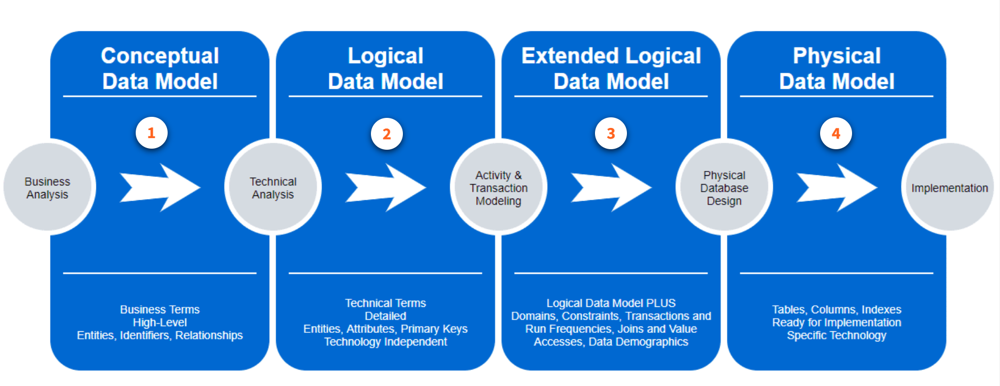
* **Conceptual**
  * using business terminology and depicting the relevant entities, relationships and potential identifiers
* **Logical**
  * add more details and might replace business terminology
* **Extended Logical**
* analyze the future workload, add more information which then become a critical input for the physical database design(Teradata call this step: activity and transaction modelling)
* **Physical**
  * create the physical data model for the RDBMS
### Dimensional Data Model
* designed for reporting
* models navigation paths (not business rules) and aligns with the work process of the business users
* emphasizes usability because the tables are defined in a way that a business uses the data and is organized in a way that a given user or group of users think about the data
    * Normalization
      * is the process of reducing a complex database schema into a simple and stable one. 
      * removing redundant attributes, keys and relationships from the conceptual data model
      * is optimized for entity level transactions
    * Denormalization
      * supports dimensional modelling: speed and simplicity
      * is optimized for answering business questions and driving decision making
    * Fact table: M to M relationship, contains one or more numerical measures that occur for the combination of keys that define each tuple in the table
## Module 5 *Data Warehouse Concepts*
A **data warehouse**is a specially constructed data repository where data is organized to be easily accessed by end users for various applications.
* common in corporations
* carry many years' worth of detailed data so **historical trends** can be analyzed
* data warehousing is a process **NOT** a product which manage and assemble data from various sources to answer business questions
### Data Mart
* data warehouse is more like an enterpriser-level
* compare to it, information in data mart pertains to a single department
* Independent Data Mart
  * isolated entities entirely separate from the enterprise data warehouse
  * derived from independent sources 
  * be viewed as data pirates
  * have high likelihood of producing data that does not match that of the warehouse
* Dependent Data Mart
  * derived from enterprise data warehouse
  * might(or not) be useful depending on the configuration
  * permits users to have full access to the enterprise data store
* Logical Data Mart
  * a form of dependent data mart
  * constructed virtually from the physical warehouse
  * data is presented using a series of SQL views
### Data Warehouse Architecture
#### Data Integration
* **Tightly**
  * define upfront structure and rules for how the data need to be rationalized, organized, and optimized for performance
  * Ease of use
  * Faster response times
  * Data quality and integrity assurance
  * Consistent results
  * best used for heterogeneous data that is frequently accessed and extensively reused with strong needs for data quality and integrity
* **Loosely**
  * apply the structure and the rules, are deferred as late as possible, often at runtime, to avoid unnecessary data preparation
  * Data is treated as raw materials stored in a close container in its original form
  * the flexibility to shape the data at the user’s discretion and the opportunity to leverage the data that would be out of reach due to the impracticality of utilizing tight coupling methods
  * best used for homogenous data that is less frequently accessed or where the structure of the source data is evolving, which makes the on-going rationalization untenable
* **Non-Integrated**
  * the purest raw form of data with no additional keys defined during acquisition or prior consumption of the data to aid the integration
  * integration of non-integrated data with loosely and tightly integrated data can occur through expertly written end user code that creates the linkages (keys) on the fly
  * the opportunity to leverage the data that would be withheld during the time in which data provisioners are working to define additional structure
  * best used for the datasets with no perceived value from integration with other datasets, or in cases where the understanding of a new dataset is still in process
### Data Layer
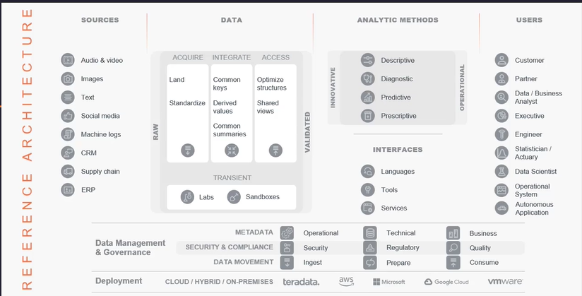
* Examples of data sources are on the left
* The data platform is next to the data sources
* Analytic methods and interfaces connect users and other data consumers to the data platform
* Examples of users and other data consumers are on the right
* On the bottom there are two fundamental sections:
  * Data management and governance is the organizational framework
  * Deployment represents the technical infrastructure
* data entering on the left side, and flowing through the data platform, interfaces and analytic methods to the users
### Data Platform
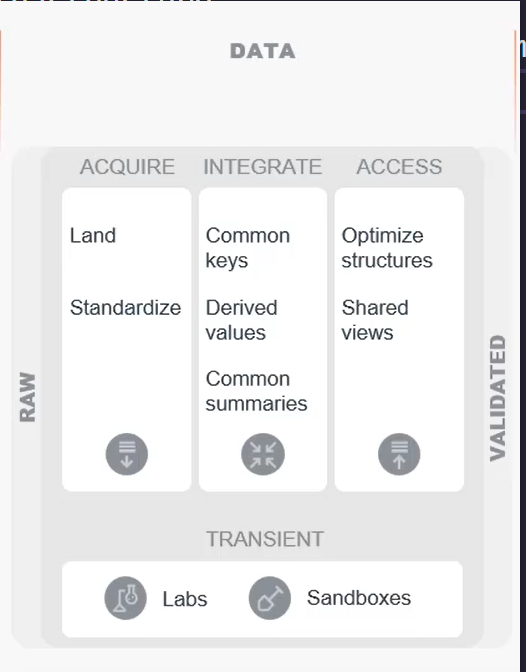
The **primary goal** is to morph raw data into validated data:
* **Raw data** is minimally processed from its source. It may have minimal checks for completeness
* **Validated data** has had sufficient quality checks to deem it fit for business use. These may have differing levels of diligence applied
   
In between, we can see four **white boxes representing data layers**. These data layers organize data into a **consistent set of reusable building blocks** and allow for **two alternative data routes**:
1. **ACQUIRE - INTEGRATE - ACCESS**
This is the route for **tightly integrating data**. This means you:
* Understand the business value of data to be added
* Want to make it accessible to a wider user base
* Want to frequently and easily combine it with other data
* Plan to structure the data in a way which is optimal for applications
* All while adhering to potentially strict data governance criteria
* **Three data layers** are traversed on this path:
  * **ACQUIRE**: As the first point of entry into the data warehouse, raw data is acquired from various source systems.
  * **INTEGRATE**: The integration layer is primarily responsible for integrating data from multiple systems both **normalized and potentially de-normalized**. It also may create **common metrics and summaries** which are widely used within an organization.
  * **ACCESS**: The access layer’s primary responsibility is to provide **easy access** to the data using various analytic methods.
2. **TRANSIENT**
For **innovative, explorative, or nonrecurring activities** tightly integrating data might impose **too much overhead**. The purpose of this data route is to provide a nimble way of gaining insight.

Transient data have not **gone through a formal operationalization process**. If a transient activity proves to be valuable, it will usually be operationalized and therefore ingested into data route #1.

A **single data layer** is traversed on this path:
* **TRANSIENT**: **Less strict** governance criteria are applied, and data are **left non-integrated** or - if necessary - they are **loosely integrated**. Walking this route requires **highly skilled staff**. Transient layer activities are usually **time-boxed**, to reduce the risk of attaching productive processes or systems to the transient layer. 
### Data Tier 
* **Acquire**
  * The landing tier contains raw data before it is processed and is the lowest level of granularity
  * The standardize tier processes raw data to be consumable
    * Incorrect data is fixed or rejected
    * Acceptable data is lightly altered to be consistent 
    * Some physical optimization may occur
* **Integrate**
  * In the common keys tier, connecting field (“IDs”) are standardized to be usable across subject areas
  * The derived values tier adds key performance indicators (KPIs) so that they do not need to be continually re-calculated
  * The common summaries tier summarizes important fields for consistency and performance
* **Access**
  * In the optimize structures tier, performance is prioritized through various physical schemes
    * Autonomous applications benefit greatly from higher performance
  * The shared views tier concentrates on ease-of-use with materialization and metadata to assist users in navigating and consuming the resulting data
* **Transient**
  * **Labs** are areas where a user can access validated data and combine it with exploratory data or even external data
    * These are usually time boxed
  * **Sandboxes** are area where a user can use the environment with various data sources
    * They may have more permanence than labs
### Types of Implementation
* Centralized
  *  useful for small and mid-size data warehouses
  *  a single physical repository
  *  serves separate department within an organization at the same time using a single data model
* Federated
  * share information among a number of different systems
  * master file will be shared and other system can use it
  * can reduce response time
* Data Mart
  * within a single organizational data warehouse repository
  * condensed an focused version of data warehouse dedicated to a specific business need
  * commonly multiple data marts to be used in order to server the needs of each department
### Deployment Options
* no right or wrong answers when choosing if to deploy a data warehouse on-prem or over the cloud
* On-prem
  * buying software and hardware from a data warehousing company
  * gives organization total control
  * most secure
  
* Cloud
  * in public or private cloud
  * trust issue is hard to overcome
  * require high bandwidth
  * private cloud can provide more security
***
## Module 6 *Data Modelling Concepts*
### Attributes
* **Primary Key(PK)**: Uniquely identifies each row in a table.
* **Foreign Key(FK)**: Identifies the relationship between tables.
* **Non-Key Attributes**: All other attributes that are not the part of any key. They are descriptive only and do not define uniqueness (PK) or relationship (FK).
* **Derived Attributes**: An attribute whose value can be calculated or derived from other existing attributes.
  * not included in the data model, because carrying redundant data goes against relational design theory and principles
#### Decomposable Data
**Data may be either decomposable or atomic.** Decomposable data can be broken down into finer, smaller units while atomic data is already at its finest level.
* There is a relational rule that domains must not be decomposed.
### Relationship
There are three types of relationships:
* One-to-many (1:M)
  * common
* Many-to-many (M:M)
  * common
* One-to-one (1:1)
  * rare
### Activity and Transaction Modeling
**Activity and transaction modeling (ATM)** is a process, structuring the collection of facts and requirements, which influence logical data modeling and physical data modeling. 
* Always avoid creating and implementing naive data models as they are not the important influencing factors.
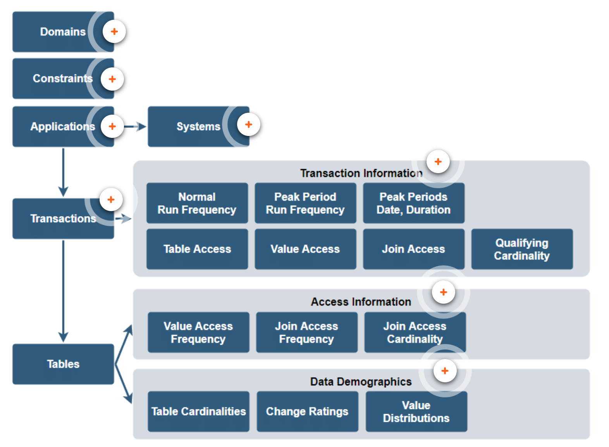
* **Domain**: named set of allowed and non-decomposable values for a particular attributes
* **Constraints**: rules restricting a data type's pool of possible values to the subset of allowed values of a specific domain. Also database mechanisms which can be used to enforce constraints in the former sense.
* **Applications**: business functions which are reflected in the database.
* **System**: groups pf related applications. The main reason for grouping into systems is that each cluster of applications typically serves a different user community within the enterprise.
* **Transaction**: business or database activities constituting an application.
* **Transaction Information**
  * normal run frequency(non-peak period)
  * Peak period run frequency
  * Peak period dates in the business cycle
  * Peak period duration
* **Access Information**: once the planned transactions have been analyzed for each tables, users can sum up the detailed transaction information of all referencing transactions
  * value access frequency
  * join access frequency
  * join access rows
* **Data Demographics**: ATM suggests collecting some demographics of the columns participating in the value accesses or join access
  * **change rating**: a categorization of column value change frequency(0-9)
  * **value distribution**
    * **no. of distinct values**:  determines how many unique values (including NULLs) exist for a column.
    * **max no. of rows per value**: check if it is significantly higher than the expected average number of rows per value 
    * **typical no. of rows per value**: s tricky because often it simply doesn’t exist. What you want to do here is analyze histograms to gain insight into column value frequencies.
    * **no. of rows with NULL**: Collect the number of rows with NULL because experience shows that NULL is frequently an outlier in terms of number of rows.
  
The **ATM process** performs the following activities:    
* **Identify and define** the attribute **domains and constraints** for physical columns based on the enterprise business rules which apply to the information to be stored in the database
* Identify and model database applications and systems
* Identify and model application transactions
* Summarize table value accesses and join accesses by column across transactions
* Compile a preliminary set of data demographics by computing table cardinalities, value distributions, and attaching change ratings to columns. This information is compiled and used as input to the physical design process

**Teradata Vantage SQL Engine do not include some support for domains.** If you want to reflect domain names in the physical data model, here are some options:
* Use the **COMMENT** statement to attach the domain name as text to each column
* Include the domain name in your column **naming convention**
* Use a **3rd party metadata repository**

**Several database mechanisms can be used to physically implement constraints:**
* Define a column as **UNIQUE**
* Define a column as **NOT NULL**
* Define a column (or several columns) as **PRIMARY KEY**
* Use the **REFERENCES** clause to define a column (or several columns) as **foreign key**
* Define **column-level CHECK** constraints
* Define **table-level CHECK** constraints

#### **Please note that Teradata Vantage SQL Engine doesn’t support any database constraint on columns defined with a UDT, XML, BLOB, or CLOB data type.**

***In order to gain insight into the future workload, ATM proposes to:***
* Identify applications
* Group identified applications by business function into systems
* Identify transactions for each application

### Transaction Information
* **General** might contains run frequency, peak run frequency and peak run frequency time
* **Detailed**
  * **Table Access**: The database tables and table columns involved.
  * **Value Access**: Whether rows are accessed by specific column values.
  * **Join Access**: Whether tables are joined, and which columns are used as join criteria.
  * **Qualifying Cardinality**: The number of rows that qualify for processing in each table. Be aware that the qualifying cardinality is **not the number of rows in the answer set**, but the **number of rows that must be processed in order to obtain the answer set**.

**Guidelines to determine what values to use:**
* Identify the number of rows, if any, that qualify for value access
* Identify the number of rows, if any, that qualify for join access
  * Select the smaller of 1 and 2 and use it as the value for the number of rows processed
  * If there are no value access rows and no join access rows, then use the number of rows in the table
***
### Normalization
 A **set of rules and a methodology** for making sure that the attributes in a relational database design are carried in the correct entity to **map accurately to reality, eliminate data redundancy, and minimize update anomalies.** Normalization is based upon relational theory and provides a rigorous way to identify and eliminate most data problems:
 * Provides **precise identification** of unique data values
 * Creates data structures which have **no anomalies for access and maintenance functions**
#### **Stated Simply: One Fact, One Place!**

##### **1st Normal Form(1NF)**
* Attributes in 1NF must not repeat within an entity
* also requires that each row has a unique identifier (PK)
* No repeating groups
##### **2nd Normal Form(2NF)**
* Attributes must relate to the entire primary key, not just a portion
* Entities with a single column primary key are always in 2NF form
##### **3rd Normal Form(3NF)**
* Attributes must relate to the primary key and not to each other
* Cover up the PK and the remaining attributes must not describe each other
##### **4th and 5th Normal Form(4NF and 5NF)**
* 4NF: The entity’s PK represents a single multi-valued fact that requires all PK attributes be present for proper representation. Attributes of a multi-valued dependency are functionally dependent on each other
* 5NF: The entity represents, in its key, a single multi-valued fact and has no unresolved symmetric constraints. A 4NF entity is also in 5NF if no symmetric constraints exist
**For short:**
* 1NF, 2NF and 3NF are **progressively more refined** and apply to non-key attributes regarding their** dependency** on primary key (PK) attributes
* 4NF and 5NF apply to **dependencies between or among PK attributes**

#### **Benefits of 3rd Normal Form (3NF):**
* Usually more tables – therefore, more primary index choices
  * Possibly fewer full-table scans
  * More data control
* Fewer columns per row – usually smaller rows
  * Better user isolation from the data
  * Better application separation from the data
  * Better blocking
  * Less transient and permanent journaling space
#### **Negative effects of violating 1NF include:**
* Places artificial limits on the number of repeating items (attributes)
* Sorting on the attribute becomes very difficult
* Searching for a particular value of the attribute is more complex
#### **Negative effects of violating 2NF include:**
* More disk space may be used
* Redundancy is introduced
* Updating is more difficult
* Can also compromise the integrity of the data model  
#### **Negative effects of violating 3NF include:**
* More disk space may be used
* Redundancy is introduced
* Updating is more costly
  
### Denormalization
Describes any **number of physical implementation techniques** that enhance performance by **reducing or eliminating the isomorphic mapping** of the logical database design on the physical implementation of that design. 

A denormalized database **favors one or a few applications** at the expense of all other possible applications.

#### **Denormalization may increase or decrease system costs:**
* It may be positive for some applications and negative for others
* It generally makes new applications **harder** to implement
* Any denormalization automatically **reduces data flexibility**
* It introduces the **potential for data problems (anomalies)**
* It usually **increases programming cost and complexity**

**Storing derived data** is a **normalization violation** that breaks the rule against **redundant** data. Whenever you have stand-alone derived data, you must decide **whether to calculate it or store it**. This decision should be based on the following demographics: 
* Number of tables and rows involved
* Access frequency
* Column data value volatility
* Column data value change schedule

#### Guidelines on what approach to take depending on the value of the demographics when you have a large number of tables and rows
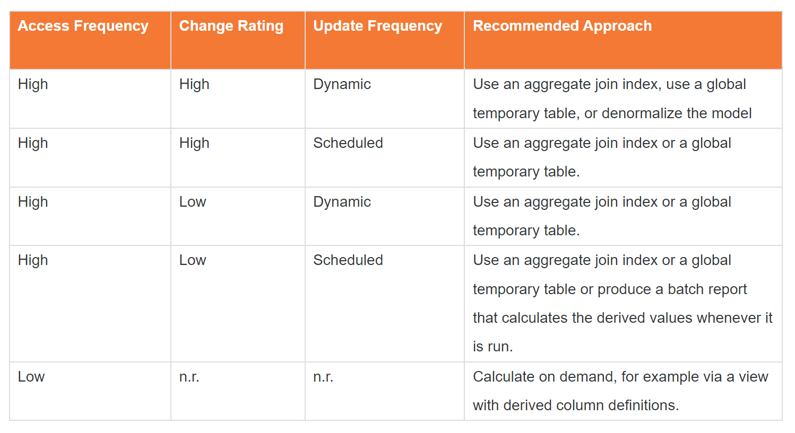

**In general, using summary/temporary tables for derived data is preferable to denormalization and is a good strategy when the derived data will be used frequently and is stable.**

**To sum up, alternatives to denormalizing for derived data are:**
* Aggregate join index
* Global temporary table with derived column definitions
* View with derived column definitions
#### Repeating Groups
Denormalizing with **repeating groups** means to store attribute values in multiple columns of a single row instead of storing those values in multiple rows of a single column. But, **this violates 1NF**.
##### Advantages and Disadvantages of Denormalizing with Repeating Groups
* **Advantages**
  * Saves disk space
  * Reduces query and load time
  * Makes comparisons among values within the repeating group easier
  * Many 3rd generation programming languages and third-party query tools work well with this structure
* **Disadvantages**
  * Difficult to detect which month an attribute corresponds to
  * Impossible to compare periods other than months
  * Changing the number of columns requires both DDL and application modifications

#### Pre-Join
Pre-joins can be created to eliminate joins to small, static tables. **It is a violation of 3rd Normal Form.**
##### Advantages and Disadvantages of Denormalizing with Pre-joins
* **Advantages**
  * A good performance technique for Teradata Vantage SQL Engine especially when there are known queries
  * A good way to handle situations where you have tables with fewer rows than AMPs
  * Have the original normalized table to maintain data consistency and avoid anomalies
* **Disadvantages**
  * Additional space required
  * More maintenance and I/Os required
  * Potential for update anomalies

Can achieve the same results obtained with pre-joins **without denormalizing** your database schema by using any of the following methods:
* Views with joins
* Join indexes
* Global temporary tables

**The Teradata Vantage SQL Engine join index feature provides a way of creating a pre-join table. As the base tables are updated, the join index is updated automatically. You get the performance benefits of pre-join tables without incurring update anomalies and without denormalizing your logical or physical database schemas.**

#### Summary Tables and Temporary Tables
* **Summary tables** are a denormalization method which is used to speed up known queries, which are accessed frequently. **Aggregate attributes over one or several dimensions** and store the results in a summary table at a higher granularity
* **Temporary tables**
  * **Global Temoprary tables**
    *  have a persistent stored definition just like any base table
    *  materialized only when it is accessed by a DML request for the first time in a session and then remains materialized for the duration of the session unless explicitly dropped
    *  At the close of the session, all rows in the table are dropped. Keep in mind that the containing database or user for a global temporary table uses PERM space to contain the table header on each AMP
    *  like join and hash indexes, are not part of the logical model
    *  they can be denormalized to any degree desired, enhancing the performance of targeted applications without affecting the physically implemented normalization of the underlying database schema
  * **Volatile tables**: do not have a persistent stored definition, but like global temporary tables, they are local to a session and are automatically dropped when the session ends.

**It is important to remember that a materialized instance of a global temporary table and a volatile table are local to the session from which they are materialized or created, and only that session can access its materialized instance. This also means that multiple sessions can simultaneously materialize instances of a global temporary table definition (or volatile tables) that are private to those sessions.**

##### **Denormalized Tables vs. Temporary Tables**
Use global **temporary tables** to enhance performance in the following ways:
* Simplify application code
* Reduce spool usage
* Eliminate large numbers of joins
Use global **temporary and volatile tables** to avoid the following denormalizations you might otherwise consider:
* Pre-joins
* Summary tables and other derived data
*  an alternative for applications that do not require persistent storage of pre-join results as offered, for example, by join indexes.

#### Denormalization Alternatives
* Views
* Join indexes
* Aggregate join indexes
* Global temporary and volatile tables
***
## Quiz

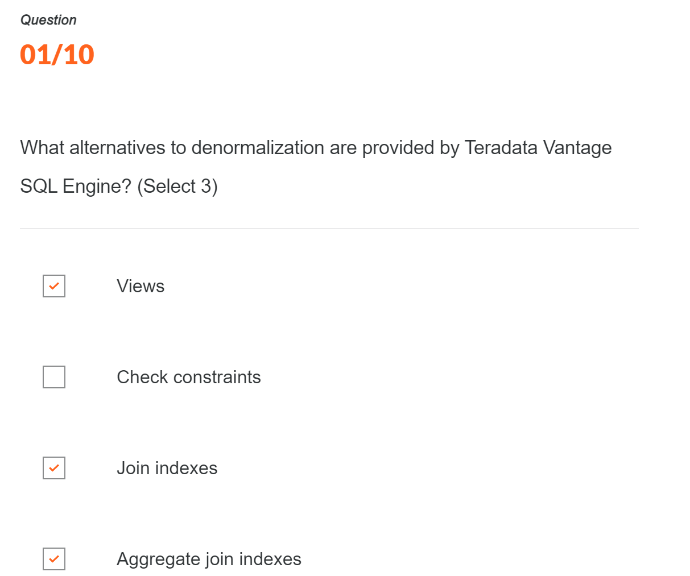
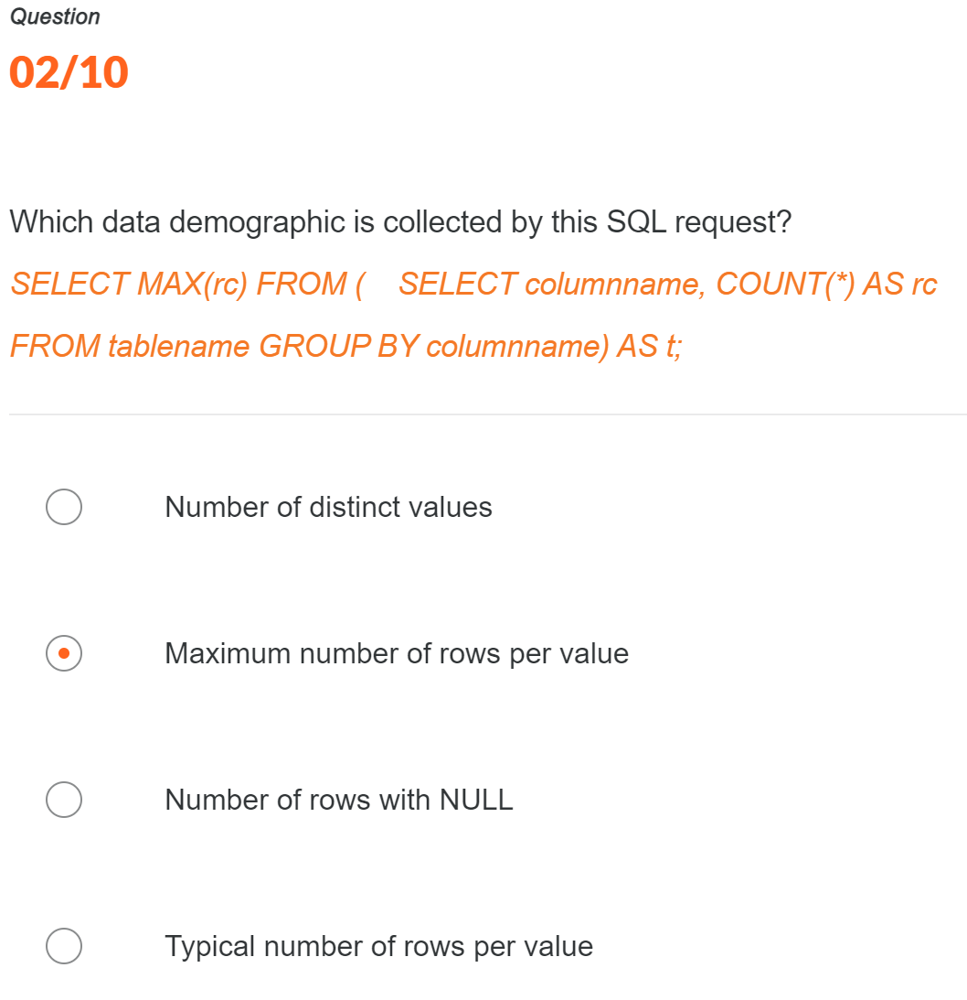
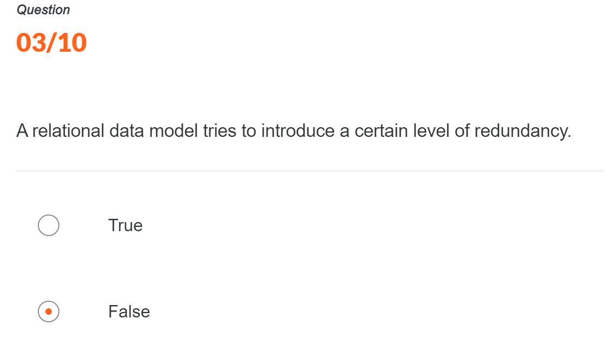
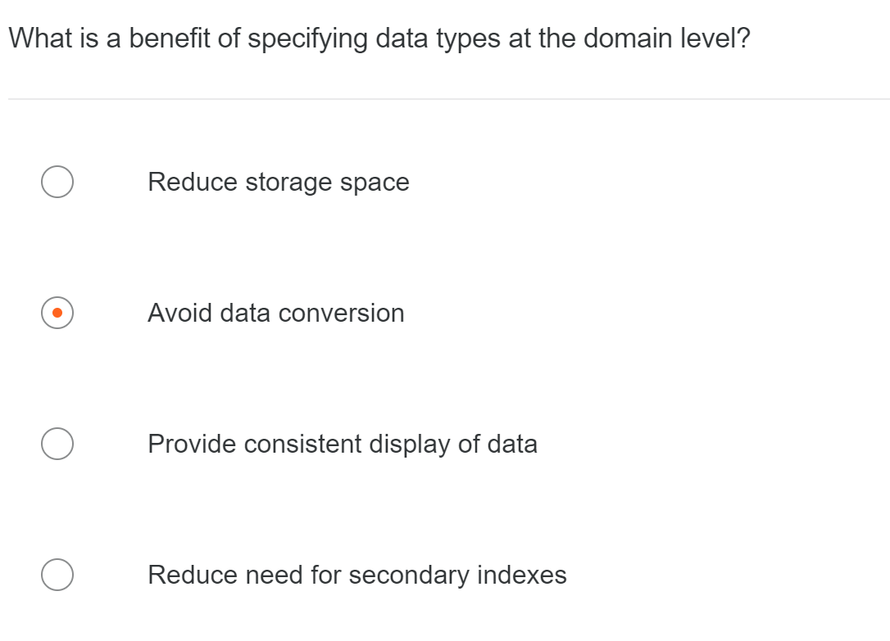
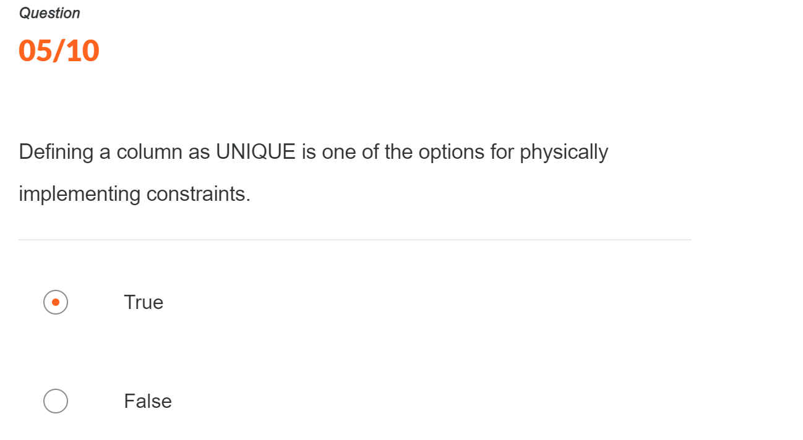
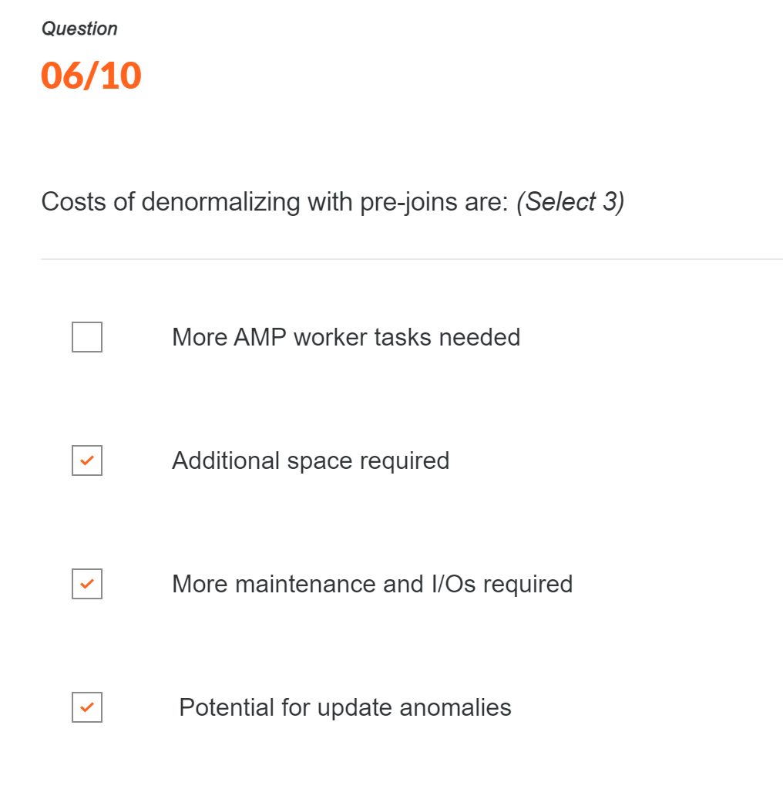
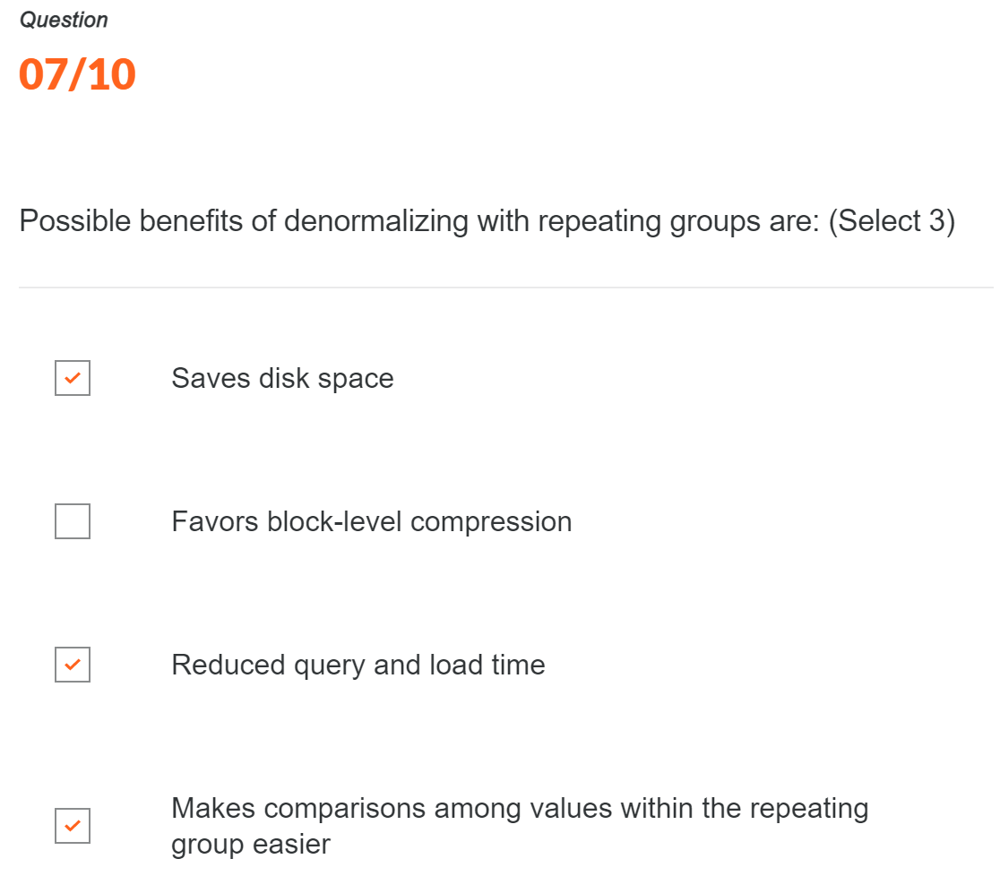
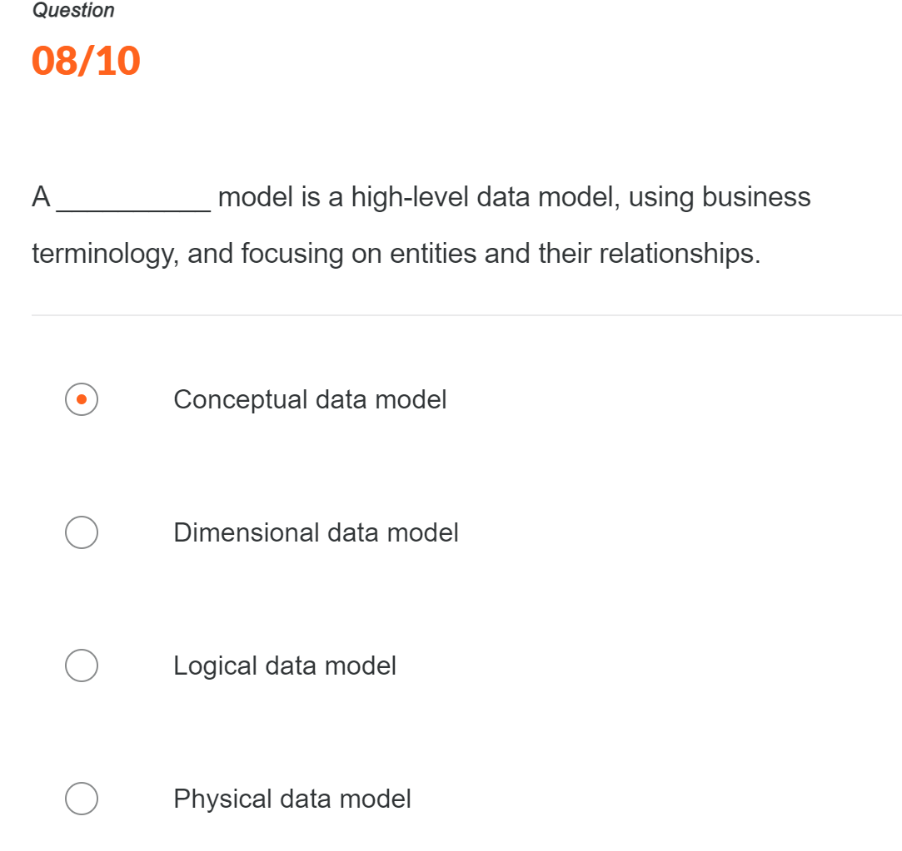

  Q9. Centralized data warehouse is not always the best option.

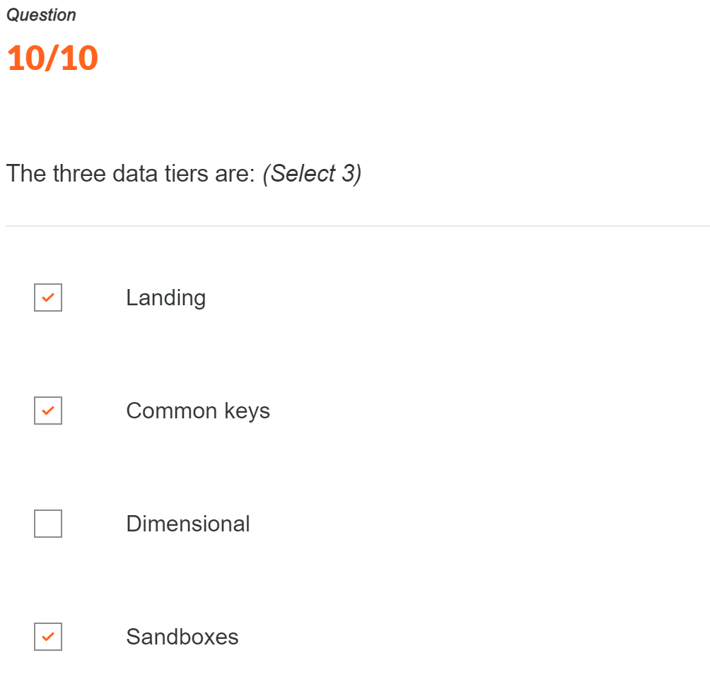

***

  

