

  

 

# **Teradata Data Engineering Introduction to Vantage 2.2(TDVAN4)**
## Module 1 *Vantage Introduction*
**Teradata Vantage** is a modern **analytics platform** that combines open source and commercial analytic technologies to operationalize insights, solve complex business problems, and enable descriptive, predictive, and prescriptive analytics. This will lead to **autonomous decision making**.

Teradata Vantage contains a **cross-engine orchestration layer** that pipelines the right data and analytic request to the right analytic engine across a **high-speed data fabric**.
### Features
* **Scale in every dimension**: Only Teradata’s **enterprise-grade, multidimensional scalability** lets people scale all dimensions simultaneously to handle the massive data workloads
* **Empower everyone with data**: Empowers people with secure, role-based, no-coding software that draws on 100% of their data to support key business goals
* **Advance your analytics**: Scales out and scales up with Machine Learning and AI, powering better quality, more models, and better results
* **Unlock answers anywhere**: Provides an ability to any user in any department to ask any questions against integrated and connected cross functional data

### Teradata Vantage Analytics Platform
* meets the exponential volume and complexity of the future, today
* modern platform for a hybrid multi cloud world
* requires a new definition of scalability and Teradata enables scale across multiple dimensions simultaneously
#### Enterprise-Grade Data Analytics Platform
* **Concurrent AD-Hoc Users**
  * World class workload management
  * Mixed workload
  * Service level driven
  * Support hundreds of queries concurrently
* **High Availability**
  * No single point of failures
  * Automatic recovery
  * Scalable ingest
* **Complete Spectrum of Data and Functions**
  * In-database processing
  * JSON, AVRO, XML
  * SQL, table functions, stored procedure
* **Total Cost of Ownership**
  * Covered in just a few steps
  * Minimal maintenance
  * Robust parallel utilities
  * Flexible, hybrid deployment options
* **Mature Optimizer**
  * Complex queries
  * Up to 128 joins per query
  * Ad-hoc processing
* **Unlimited Parallelism**
  * All sorts, joins
  * ALl aggregations
  * Even data distribution
* **Unlimited Proven Scalability**
  * Linear performance slope of 1
  * Designed for shared nothing operations
  * Customer proven since 1984
* **Model Business**
  * 3rd normal form
  * Robust view processing
  * Star schema views
  * Multiple index options
#### Capabilities
* Functions for geo-spatial
* Time series
* Temporal 
* Path analysis
* 50+ built-in functions in its Vantage Analytics Library (VAL)
* **In-database analytics** for high-performance parallel processing 
  * **Geo-spatial, Time Series, Temporal, Pathing** - Powerful extensions to traditional relational operations
  * **Vantage Analytics Library** - Suite of advanced analytic functions
  * **Bring Your Own Model (BYOM)** - Score entire data set in parallel
### Vantage Differentiation
**Data** is the **driver** of ever-increasing business value and is driven by a modern architecture with benefits being **business process continuity, lower risk, faster adoption, leveraging existing governance, and data reuse**.

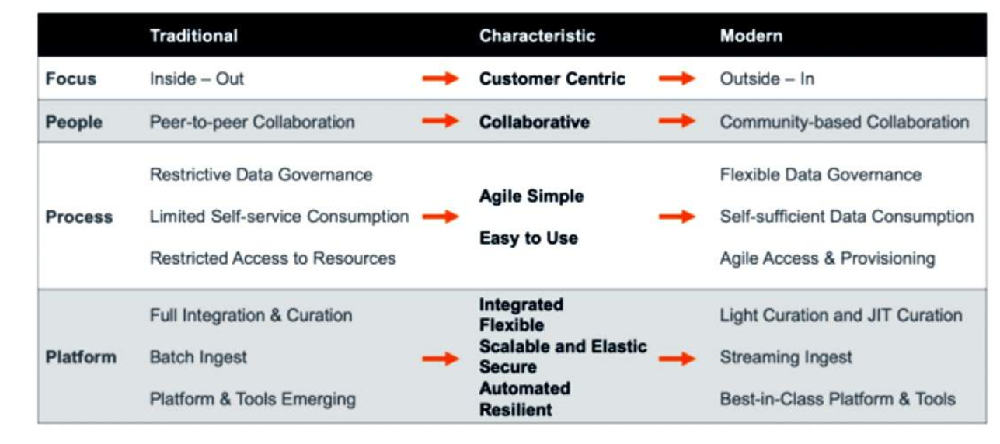
### Introducing Vantage Architecture
Vantage analytics platform has multiple components but the **core** still remains with the immensely powerful **Advanced SQL Engine**. 
* All languages access the same data and data stores
* Seamless user experience; no need to know where data resides
* Runs queries and joins across structured and semi-structured data
* Handles complex data requirements with parallel processing
***
## Module 2 *Native Object Store(NOS)*
* Support structured, semi-structured and unstructured data
* Have features like scalability
* Have low cost per TB
* Support open formats like Parquet, JSON, CSV
* Help support popular use cases like data-lakes, data archival, and data sharing
#### Native Object Store (NOS) Architecture
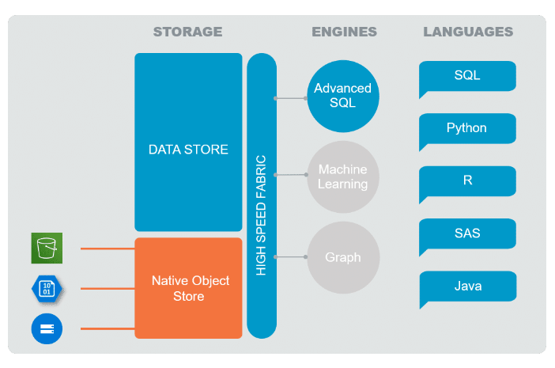
* enables business analysts, system administrators, data scientists, and database administrators to use standard Teradata SQL and APIs to:
  * Search and query CSV, JSON, and Parquet format datasets located on external object storage platforms
  * Write data stored on Vantage to external object storage platforms
* supports Amazon S3 , Azure Blob Storage, and now Azure Data Lake Storage (ADLS) Gen2 and Google Cloud Storage (GC)
* supports both on-premises as well as the public cloud (AWS, Azure and GC)

#### Benefits
* **Use of Object store**: Customers continue to put more data in object stores, both on-premises and in the cloud as a Hadoop alternative.
* **Better Access and Processing Object Store**: allows users to access and analyze the vast amount of data in object stores, which provide more processing speed.
* **Fits in State of Art Architecture**: better fit for customers keeping cloud and object stores in their future road map.
* **Hybrid Solution**: cloud-centric functionality allows Teradata to be viewed as a hybrid cloud solution and should be considered for hybrid cloud discussions.
* **Low Cost Solution**: Costs per TB is comparatively less when compared to traditional data stores. 
#### Features
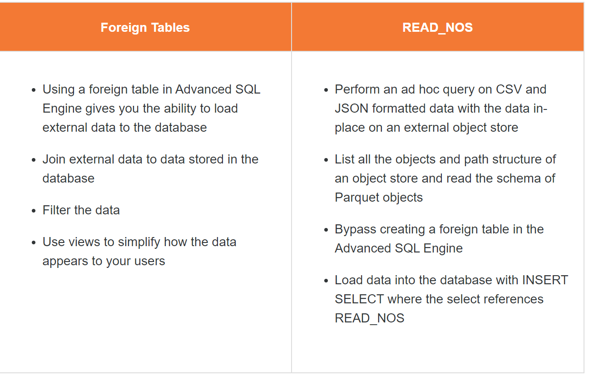
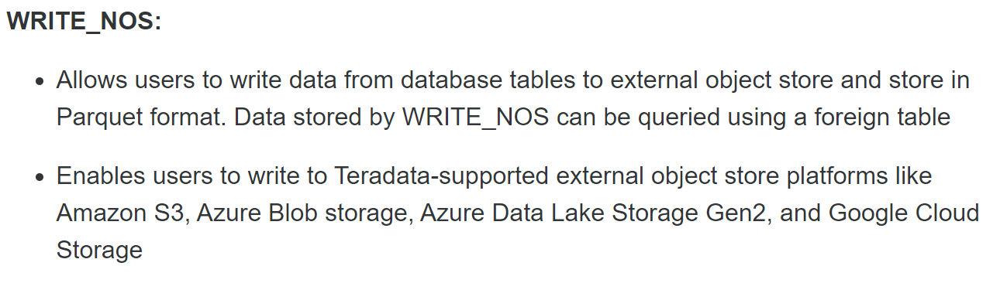

### Foreign Table
Users can create a foreign table on Advanced SQL Engine the same as a local Vantage table to access data files on an external object store like Amazon S3, Azure Blob or Google Storage.
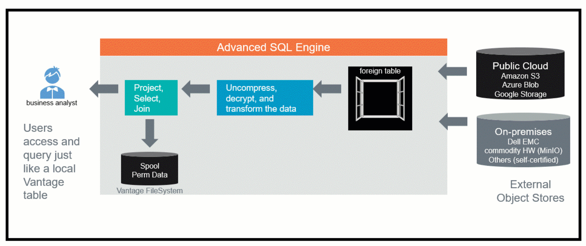
Connections between the Advanced SQL Engine and object stores always use an HTTPS connection.
#### Syntax

  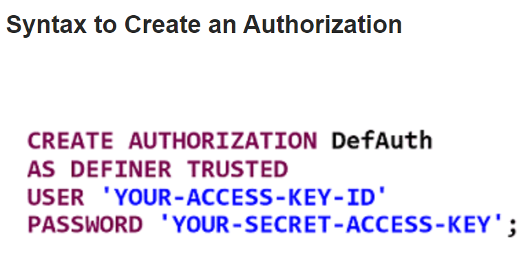
  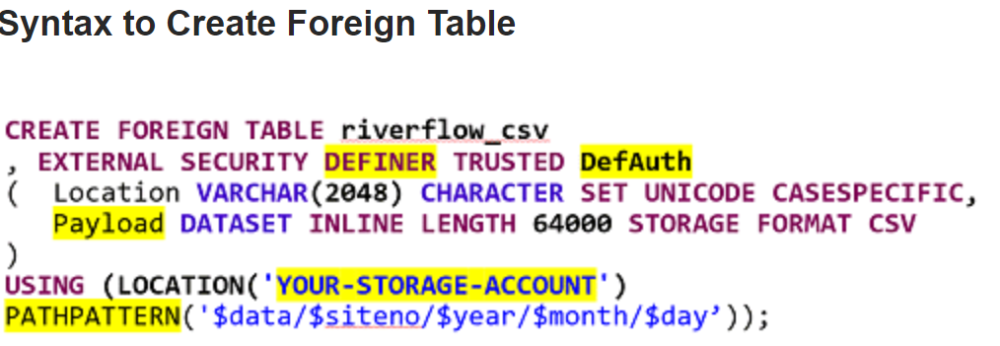
  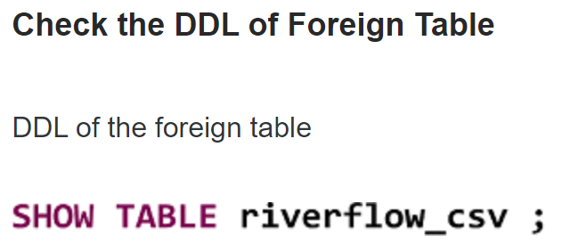

### READ_NOS
READ_NOS allows data exploration **without the need to create a foreign table**. It requires similar credentials to target bucket/container.
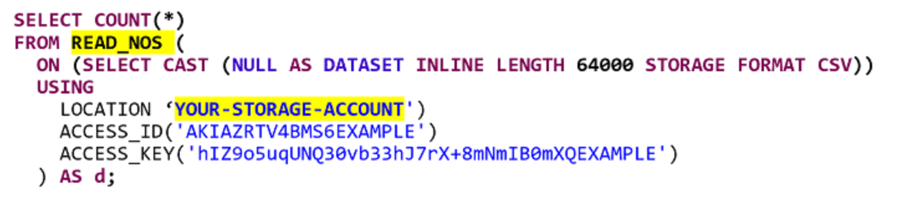
#### READ_NOS Display Options

* **NOSREAD_KEYS** - It lists the files in the specified LOCATION
  * ObjectLength is the size of the external files in the specified LOCATION of the object store. Need to be defined.

  * For public bucket, ACCESS_ID and ACCESS_KEY are empty strings.

  * For private bucket, the credentials are inside the single quotes

  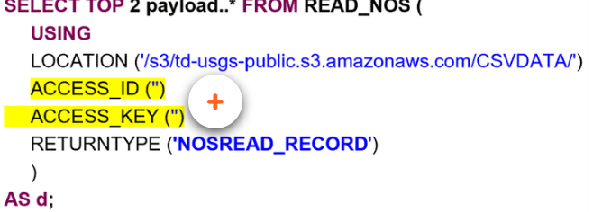

* **NOSREAD_RECORD** - It returns the payload from the specified LOCATION

  

Its **not always feasible** to use Access_ID and Access_Key while selecting data from S3 buckets. Users can follow a specific method to prevent the use of specifying credentials with each SQL statement by creating a function mapping.
**Use authorization object(DefAuth in the example) to create a function mapping**

**Using SELECT Statement for READ_NOS Function Mapping**
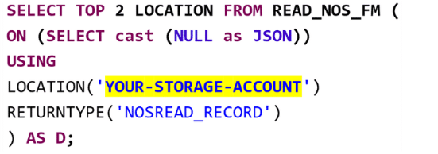

### WRITE_NOS
* **WRITE_NOS** allows users to write data from database tables to external object store and store it in Parquet format
* Data stored by WRITE_NOS can be queried using a **foreign table** 
* WRITE_NOS enables the users to write to **Teradata-supported external object store platforms** like Amazon S3, Azure Blob storage, Azure Data Lake Storage Gen2 and Google Cloud Storage
* WRITE_NOS can be used to **transform** CSV and JSON data **without writing it locally** to a relational table
* Read the CSV or JSON data using CREATE FOREIGN TABLE or READ_NOS, then use WRITE_NOS to write the data in Parquet format
* WRITE_NOS is used to **copy data** to an external object store.
 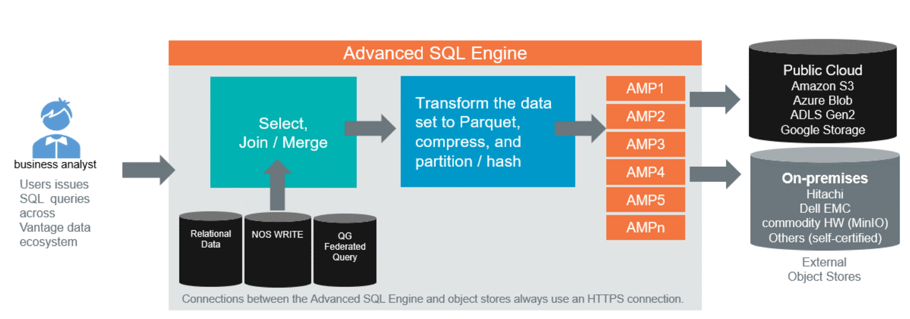 
#### Syntax
 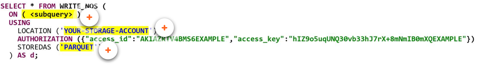 
* **(< subquery >)** defines what data set to be written to the external object store
* **YOUR_STORAGE_ACCOUNT** locates the points to the target external object store
* **PARQUET** is the only format that supported by WRITE_NOS
* **For auth obj**
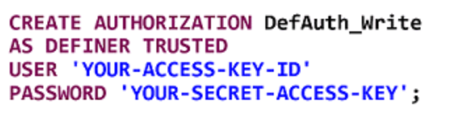 
* **For function mapping**
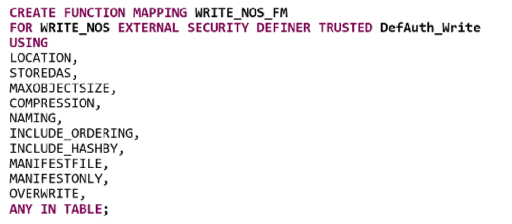
***
#### Example
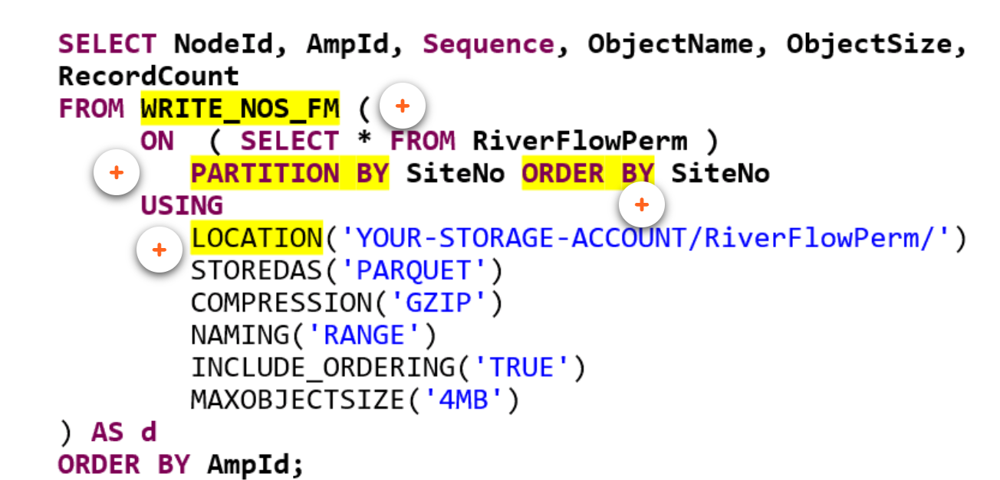
* **WRITE_NOS_FM** used with authorization object to hide the credentials and other configuration settings from the end user
* **PARTITION BY** redistributes the rows between the AMPs prior to invoking WRITE_NOS
* **ORDER BY** sorts the data on the AMP prior to invoking WRITE_NOS
  
## Module 3 *QueryGrid*
***
## Module 4 *Teradata Parallel Transporter(TPT)*

***

  

