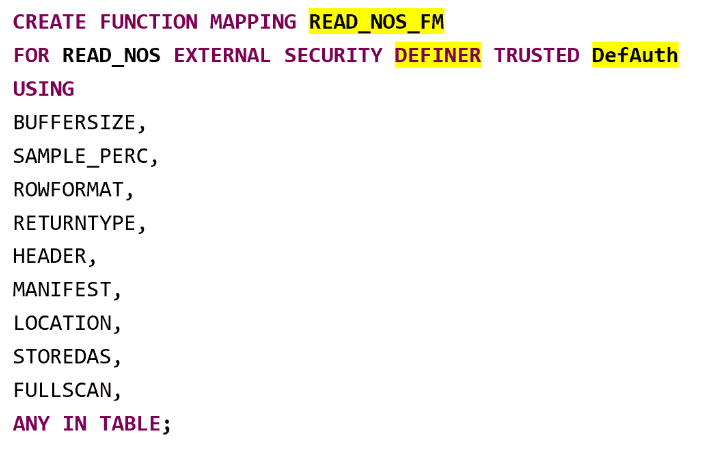
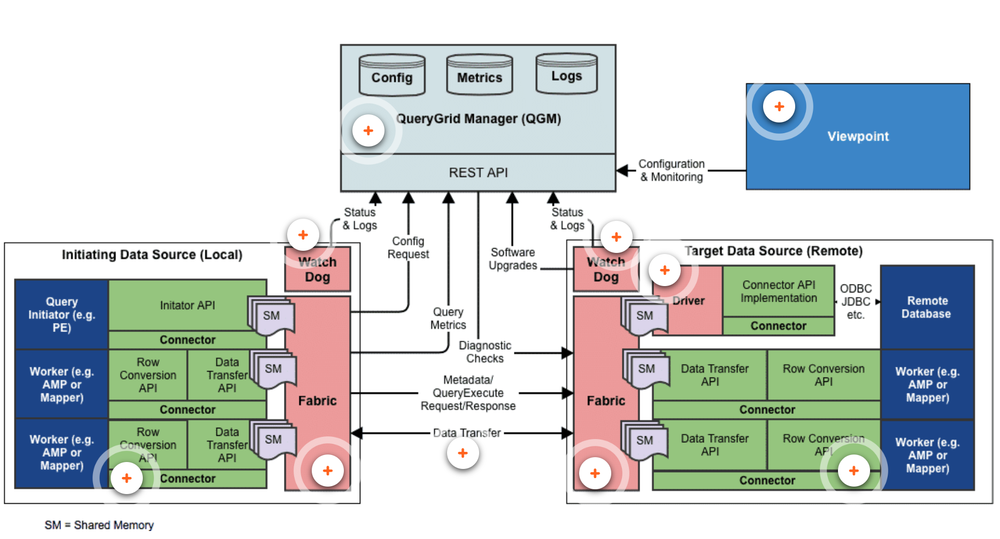

  

 

# **Teradata Data Engineering Introduction to Vantage 2.2(TDVAN4)**
## Module 1 *Vantage Introduction*
**Teradata Vantage** is a modern **analytics platform** that combines open source and commercial analytic technologies to operationalize insights, solve complex business problems, and enable descriptive, predictive, and prescriptive analytics. This will lead to **autonomous decision making**.

Teradata Vantage contains a **cross-engine orchestration layer** that pipelines the right data and analytic request to the right analytic engine across a **high-speed data fabric**.
### Features
* **Scale in every dimension**: Only Teradata’s **enterprise-grade, multidimensional scalability** lets people scale all dimensions simultaneously to handle the massive data workloads
* **Empower everyone with data**: Empowers people with secure, role-based, no-coding software that draws on 100% of their data to support key business goals
* **Advance your analytics**: Scales out and scales up with Machine Learning and AI, powering better quality, more models, and better results
* **Unlock answers anywhere**: Provides an ability to any user in any department to ask any questions against integrated and connected cross functional data

### Teradata Vantage Analytics Platform
* meets the exponential volume and complexity of the future, today
* modern platform for a hybrid multi cloud world
* requires a new definition of scalability and Teradata enables scale across multiple dimensions simultaneously
#### Enterprise-Grade Data Analytics Platform
* **Concurrent AD-Hoc Users**
  * World class workload management
  * Mixed workload
  * Service level driven
  * Support hundreds of queries concurrently
* **High Availability**
  * No single point of failures
  * Automatic recovery
  * Scalable ingest
* **Complete Spectrum of Data and Functions**
  * In-database processing
  * JSON, AVRO, XML
  * SQL, table functions, stored procedure
* **Total Cost of Ownership**
  * Covered in just a few steps
  * Minimal maintenance
  * Robust parallel utilities
  * Flexible, hybrid deployment options
* **Mature Optimizer**
  * Complex queries
  * Up to 128 joins per query
  * Ad-hoc processing
* **Unlimited Parallelism**
  * All sorts, joins
  * ALl aggregations
  * Even data distribution
* **Unlimited Proven Scalability**
  * Linear performance slope of 1
  * Designed for shared nothing operations
  * Customer proven since 1984
* **Model Business**
  * 3rd normal form
  * Robust view processing
  * Star schema views
  * Multiple index options
#### Capabilities
* Functions for geo-spatial
* Time series
* Temporal 
* Path analysis
* 50+ built-in functions in its Vantage Analytics Library (VAL)
* **In-database analytics** for high-performance parallel processing 
  * **Geo-spatial, Time Series, Temporal, Pathing** - Powerful extensions to traditional relational operations
  * **Vantage Analytics Library** - Suite of advanced analytic functions
  * **Bring Your Own Model (BYOM)** - Score entire data set in parallel
### Vantage Differentiation
**Data** is the **driver** of ever-increasing business value and is driven by a modern architecture with benefits being **business process continuity, lower risk, faster adoption, leveraging existing governance, and data reuse**.

### Introducing Vantage Architecture
Vantage analytics platform has multiple components but the **core** still remains with the immensely powerful **Advanced SQL Engine**. 
* All languages access the same data and data stores
* Seamless user experience; no need to know where data resides
* Runs queries and joins across structured and semi-structured data
* Handles complex data requirements with parallel processing
***
## Module 2 *Native Object Store(NOS)*
* Support structured, semi-structured and unstructured data
* Have features like scalability
* Have low cost per TB
* Support open formats like Parquet, JSON, CSV
* Help support popular use cases like data-lakes, data archival, and data sharing
#### Native Object Store (NOS) Architecture

* enables business analysts, system administrators, data scientists, and database administrators to use standard Teradata SQL and APIs to:
  * Search and query CSV, JSON, and Parquet format datasets located on external object storage platforms
  * Write data stored on Vantage to external object storage platforms
* supports Amazon S3 , Azure Blob Storage, and now Azure Data Lake Storage (ADLS) Gen2 and Google Cloud Storage (GC)
* supports both on-premises as well as the public cloud (AWS, Azure and GC)

#### Benefits
* **Use of Object store**: Customers continue to put more data in object stores, both on-premises and in the cloud as a Hadoop alternative.
* **Better Access and Processing Object Store**: allows users to access and analyze the vast amount of data in object stores, which provide more processing speed.
* **Fits in State of Art Architecture**: better fit for customers keeping cloud and object stores in their future road map.
* **Hybrid Solution**: cloud-centric functionality allows Teradata to be viewed as a hybrid cloud solution and should be considered for hybrid cloud discussions.
* **Low Cost Solution**: Costs per TB is comparatively less when compared to traditional data stores. 
#### Features

### Foreign Table
Users can create a foreign table on Advanced SQL Engine the same as a local Vantage table to access data files on an external object store like Amazon S3, Azure Blob or Google Storage.

Connections between the Advanced SQL Engine and object stores always use an HTTPS connection.
#### Syntax

  
  
  

### READ_NOS
READ_NOS allows data exploration **without the need to create a foreign table**. It requires similar credentials to target bucket/container.

#### READ_NOS Display Options

* **NOSREAD_KEYS** - It lists the files in the specified LOCATION
  * ObjectLength is the size of the external files in the specified LOCATION of the object store. Need to be defined.

  * For public bucket, ACCESS_ID and ACCESS_KEY are empty strings.

  * For private bucket, the credentials are inside the single quotes

  

* **NOSREAD_RECORD** - It returns the payload from the specified LOCATION

  

Its **not always feasible** to use Access_ID and Access_Key while selecting data from S3 buckets. Users can follow a specific method to prevent the use of specifying credentials with each SQL statement by creating a function mapping.
**Use authorization object(DefAuth in the example) to create a function mapping**

**Using SELECT Statement for READ_NOS Function Mapping**

### WRITE_NOS
* **WRITE_NOS** allows users to write data from database tables to external object store and store it in Parquet format
* Data stored by WRITE_NOS can be queried using a **foreign table** 
* WRITE_NOS enables the users to write to **Teradata-supported external object store platforms** like Amazon S3, Azure Blob storage, Azure Data Lake Storage Gen2 and Google Cloud Storage
* WRITE_NOS can be used to **transform** CSV and JSON data **without writing it locally** to a relational table
* Read the CSV or JSON data using CREATE FOREIGN TABLE or READ_NOS, then use WRITE_NOS to write the data in Parquet format
* WRITE_NOS is used to **copy data** to an external object store.
  
#### Syntax
  
* **(< subquery >)** defines what data set to be written to the external object store
* **YOUR_STORAGE_ACCOUNT** locates the points to the target external object store
* **PARQUET** is the only format that supported by WRITE_NOS
* **For auth obj**
 
* **For function mapping**

***
#### Example

* **WRITE_NOS_FM** used with authorization object to hide the credentials and other configuration settings from the end user
* **PARTITION BY** redistributes the rows between the AMPs prior to invoking WRITE_NOS
* **ORDER BY** sorts the data on the AMP prior to invoking WRITE_NOS
  
## Module 3 *QueryGrid*
**Teradata QueryGrid** is a **data analytics fabric** that provides high-performing data **access, processing, and movement** across two or more data sources.
* **Analytics Fabric** powered by QueryGrid. It is a cohesive data fabric that spans multiple systems.
* **Access** means facilitates connecting to diverse systems, such as Oracle and Hadoop.
* **Processing** provides the flexibility to integrate different file systems, operating systems, data types, analytic engines, and system design characteristics. 
* **Movement** means query execution is secure and optimized across multiple processing engines and repositories.
### QueryGrid Data Fabric
* Users submit queries through the Advanced SQL Engine
* QueryGrid coordinates data transfer between the engines and transfers results
* QueryGrid supports external data access and multi-system analytics
* Users no longer need to perform data movement to execute advanced analytics
* QueryGrid supports several entry points and targets

#### Data Transfer Process
1. User issues query from entry point system (Teradata) accessing data in a foreign system (Presto)
2. Remote part of query is sent to foreign server (Presto)
3. Query executes on foreign server (Presto)
4. Data type conversion is done in parallel on foreign server (Presto)
5. Data is pushed in parallel back to Teradata from Presto
6. Final query steps with local result occurs on the entry point system (Teradata)

### QueryGrid Architecture Components

* **QueryGrid Manager**
  * provides centralized administration and monitoring
  * perform functions
  * can be clustered for high availability
* **Watch Dog**
  * manages QG software on each node and reports status and logs to the QG manager
  * fabric or driver crashes are reported to QG manager. It will attempt to restart any crashed processes
* **Fabric** provides the services and libraries that connectors use to communicate
* **Connector** connects a data source to the Fabric
* **Driver** receives requests from the initiator connector and submits the requests to the target system
* **Link** is the pair of connectors(initiator and target endpoints)
* **Viewpoint** provide configuration and monitoring of user interfaces
### QueryGrid Key Differentiators
* Enables **connection** from one environment to another for processing and data at scale
* **Optimization** from Teradata Infrastructure
* **Leverages the power** of the Teradata Advanced SQL Engine
* Fully **parallel** data movement
* **Decrease data movement**
#### Features to decrease data movement
* **Push-Down Processing**
  * support native code and execution on target/remote systems
  * Processing can be **pushed** to the target/remote system to leverage native functionality and enhancements
* **Remote Table Optimization(RTO)**
  * allows Teradata’s Optimizer to use foreign/remote system statistics to make query decisions
  * decides when and where to perform the final join process – locally (on entry point) or remotely (on target)
### Using QueryGrid
Accessing remote/target systems may be obscured using **views** inside of Teradata. **Using views to obscure remote/target system access** provides the following benefits: 
* Supports access controls 
* Abstracts the complexity to end users
* Extends support to BI and other tools
* Allows for granular workload management control
QueryGrid provides **bridges** between systems and expands choices for data placement.
***
## Module 4 *Teradata Parallel Transporter(TPT)*
Is effectively an **object-oriented software system** that executes multiple instances of data extraction, transformation, and load functions in a scalable, high-speed parallel processing environment. It is an effectively parallel load and export utility.
### Characteristics
* **High Performance**
  * Parallel export and load operators eliminate sequential bottlenecks
  * Data Streams eliminate the overhead of intermediate (persistent) storage
  * Scalable
  * End-to-end parallelism
* **Easy to use** 
  * Single SQL like scripting language
  * Access to various data sources
* **Extensible**
  * Direct API enables third party partners to write 'C' code to directly load/unload data to/from Teradata
### TPT Operators
**Software components** that provide the actual data extraction, transformation, and load functions in support of various data stores. 
* **Producer Data Extraction Functions**
  * get data from Vantage or external data store
  * generate data internally
  * pass data to other operators by way of the operator interface
* **Consumer Data Loading Functions**
  * accept data from other operators by way of the operator interface
  * load data into Vantage or to external data store
* **Filter Data Transformation Functions**
  * Selection, validation, cleansing and condensing
* **Standalone Operators**
  * perform processing that does not involve receiving data from or sending data to the data stream
#### Architecture

### INMOD and OUTMOD
The application utilities allow input data to be read or pre-processed by a user-written **INMOD routine**. The routines call the defined program module, which is responsible for delivering an input record.
* **INMOD**
  * **a user exit routine** used by utilities to supply or pre-process input records
  * **Generating** records to be passed to the utility
  * **Validating** a data record before passing it to the utility
  * **Reading** data directly from one or more database systems such as Oracle
  * **Converting** fields in a data record before passing it to the utility
* **OUTMOD**
  * **a user-written program** that does post-processing of the data after the utility (e.g., FastExport) has retrieved the data. 
  * **Export** data to an **Output Modification (OUTMOD) routine**. You can write an OUTMOD routine to **select, validate, and pre-process** exported data.

### TPT Access Module
software modules that **encapsulate the details of access** to various data stores. Access modules provide TPT with **transparent and uniform** access to various data sources.

### TPT Operators and Teradata Utilities
**TPT replaces the Teradata Utilities.**
|   Operator      | Equivalent   | Purpose                                                    |
| ----------------|:------------:| ----------------------------------------------------------:|
|   Load          | FastLoad     | Loads an empty table (high-volume load)                    |
|   Update        | MultiLoad    | Updates, inserts, and deletes                              |
|   Stream        | TPump        | Continuously loads database tables using SQL protocol      | 
|   DDL           | BTEQ         | 	Executes DDL, DCL, and self-contained DML SQL statements  |                                                 |
|   Export        |FastExport| Exports data from the database (high-volume export)|
|   DataConnector | Data Connector (PIOM)     | Reads data from and writes data to flat files                  |
|   ODBC          | Teradata Access Module for OLEDB    | Exports data from any non-database source that has an ODBC driver |
|   SQL           | BTEQ        | Inserts data into a database table using SQL protocol    |

## Quiz

  Q5. PARQUET is the only format that supported by WRITE_NOS

***

  

