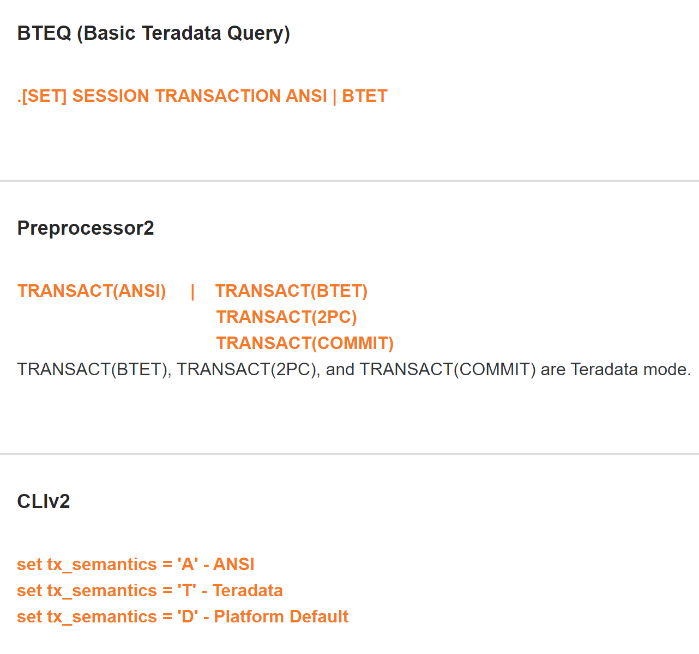
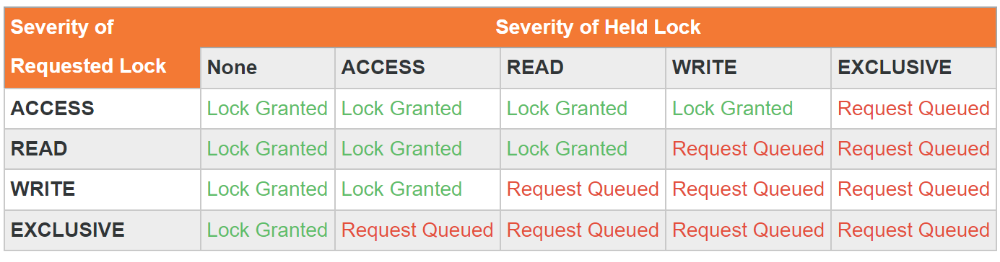
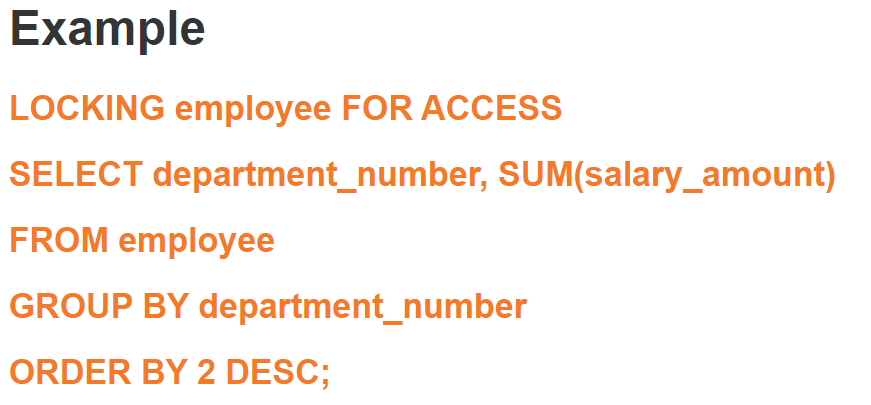
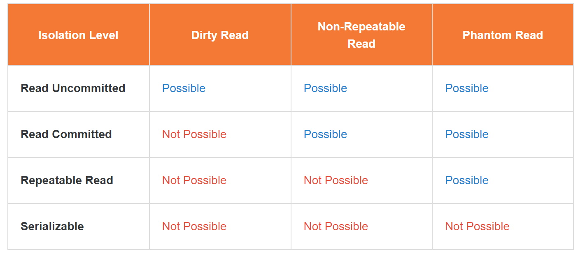

  

 

# **Teradata Data Engineering Transaction Processing and Lock Management(TDVAN4)**

## Module 1 *Session and Transactions in Vantage*
### Session
* A **session** is a **logical connection** between the user and Teradata Vantage that allows users to **submit** one transaction at a time and receive one response at a time. 
* Any current session can have **only one** transaction outstanding at any time.
* A user may communicate through **one or more** active sessions concurrently.
* A session is **explicitly** logged on and off from Teradata Vantage.
  * **Logged On**: A session is established when the Teradata Vantage server accepts the logon string of the user.
  * **Logged Off**: When a session is logged off the system discards the user-session identification and does not accept additional Teradata SQL statements from that Session.
##### The Database Administrator can **specify the number of sessions** a user or utility can use at a time. The maximum number of sessions per parsing engine (PE) is 120.

##### Utility session rules specify the number of sessions that a utility job can use. 
To create utility session rules in the Workload Designer portlet in Viewpoint, you can access the Utility Sessions tab from the Sessions view. **Utility session rules override** the minimum and maximum session limits in scripts (the MINSESS and MAXSESS parameters). For **non-conforming** utilities, utility session rules override **only the maximum** session limits.

### Transaction Processing in Teradata Vantage
Processing in Vantage is **transaction-based**. The principal purpose of transaction management is to **optimize concurrency** to ensure that as many sessions as possible can access the information in the database concurrently without compromising the consistency or integrity of the data.
* **Transaction**
  * Consists of one or more **requests**
  * Unit of work (a **set of SQL** operations to be performed)
  * Unit of recovery (a **set of rollback operations** to be performed)
  * Can be **implicit or explicit** ET (Teradata mode) or **COMMIT WORK** (ANSI mode) which commits the currently active EXPLICIT transaction
  * A **DDL** command must be the **last request** in a transaction
  * At the **end of a transaction**, two important activities occur:
    * The **transient journal** (TJ) images are discarded from the WAL log
    * The **locks are released**
* **Requests**
  * Consists of one or more **statements** 
  * A **minimal** unit of work that is transmitted from a client system
    * Request-level API options
    * Zero or more SQL statements
    * Request-related metadata
    * Request-related data
  * Gets **parsed** (syntax checking, resolving, security, optimization)
  * Applies the **most restrictive** locks of all statements in the request (i.e., there is no upgrading of locks within a request)
  * May be committed **implicitly** (i.e., as an implicit transaction)
  * Is all or nothing (i.e., should any statement error or fail, the request will error or fail)
  * **Cannot** mix DML and DDL in the same request
* **Statements**
  * An SQL construct 
  * Requires locks
  * May be sent, by itself, as a request
  * May be one statement in a multi-statement request
  * May be components of a macro
  * May be components of an SQL procedure
###  Differences between Teradata and ANSI modes 
* **Teradata Transaction Mode**
  * Teradata session mode is also referred to as **Begin Transaction End Transaction (BTET) mode**
  * Each request submitted in Teradata session mode is an **implicit transaction** unless it is preceded by a **BEGIN TRANSACTION** statement, in which case, the transaction becomes **explicit**
  * The default is that a transaction is implicit. Explicit transactions are available using the BT and ET commands
  * CREATE TABLE – Defaults to **SET** table
  * Data comparison is **NOT case specific**
  * Allows **truncation** of display data (Example: Insert ‘Teradata’ in column data type CHAR(6) -> Insert ‘Terada’ and successful)
  * Error Behavior – Only Warnings, Failures and Successes are notified, but **not the Errors**. A Failure rolls back the entire transaction and releases the locks
  * Failure Behavior – **Rolls back** the transaction whether implicit or explicit and releases all locks
  
* **ANSI(American National Standard Institute) Transaction Mode**
* ANSI mode may also be referred to as **COMMIT** mode
* ANSI mode **automatically aggregates** the requests **until** an explicit COMMIT command is encountered. Thus, **all the transactions** in ANSI mode are by definition **explicit**. ANSI session mode **does not** have implicit transactions
* All transactions are explicit and a COMMIT WORK is required to successfully commit all completed work
* CREATE TABLE – defaults to **multiset** table and data comparison is case specific
* **Forbids** truncation of display data (Example: Insert ‘Teradata’ in column data type CHER(6) -> error)
* Error Behavior – Errors roll back **only the request that causes them**, not the entire transaction
* Failure Behavior – Rolls back the transaction and releases all locks
### Multi-Statement Request
**Users can request more than one statement as a single transaction.**
Multi-statement requests act as a **single transaction**. Either the work from all statements gets committed or none of it does. Multi-statement requests can:
* Can include only DML statements
* Statements are performed in order, with knowledge of dependencies
* Most exclusive locks are held for the entire request
* If one statement fails, the total request fails and rolls back
* A multi-statement request can be committed either:
  * Implicitly by a line-ending SEMICOLON character (;) in Teradata session mode 
  * Explicitly with a COMMIT request in ANSI session mode 
  * END TRANSACTION request in Teradata session mode(Users can only submit an END TRANSACTION request to terminate an explicit transaction initiated with a BEGIN TRANSACTION request)
##### An advantage of multi-statement requests is that they minimize deadlocks at the table level when many users execute requests on the same tables.
### Changing Session Mode

***
## Module 2 *Lock Management in Teradata Vantage*
**Locking** prevents multiple users who are trying to **change the same data** at the same time from **violating the data's integrity**. This concurrency control is implemented by **locking the desired data**. Locks are automatically acquired during the processing of a request and released at the termination of the request. In addition, users can specify locks. The type and level of locks are automatically chosen based on the type of SQL command issued.
### Locking Severity
* **Exclusive**
  * Only applied to databases or tables never to rows
  * most restrictive
  * all other users are locked out
  * used rarely
  * when structural changes are being made to the database
  * SQL statement:
    * CREATE | DROP | MODIFY DATABASE
    * CREATE | DROP | ALTER TABLE
* **Write**
  * Enable users to modify data while locking out all other users except readers not concerned about data consistency
  * no new read or write locks are allowed
  * SQL Statement:
    * INSERT, UPDATE, or DELETE request.
* **Read**
  *  ensure consistency during read operations
  *  Several users may hold concurrent read locks on the same data during which no modification of the data is permitted
  *  SQL Statement:
     *  SELECT
* **Access**
  * Can be specified by users who are not concerned about data consistency
  * allows for reading data while modifications are in process
  * designed for decision support on large tables that are updated only by small single-row changes
  * sometimes called stale read locks
  * SQL Statement:
    * Placed in response to a user-defined **LOCKING FOR ACCESS** modifier 
    * by setting the session default isolation level to **READ UNCOMMITTED** using the **SET SESSION CHARACTERISTICS AS TRANSACTION ISOLATION LEVEL** statement.
### Locking Conflict
The following table summarizes the action taken when a requested locking severity **competes** with an existing locking severity.

### Locking Level
* **Database**: All rows of all tables/views in the specified database and their associated secondary index sub-tables
* **Table/View**: All rows in the specified base table and in any secondary index and fallback sub-tables associated with it
* **Partition**: All rows in a partition for the specified table or single-table view. The table must be row partitioned. This lock **permits** other users to **access** the data in the table that are **not** in the same partition
* **Row Hash**: All rows sharing the same row hash value for the **specified table** or **single-table view**. For a row-partitioned table this lock level applies to the row hash value for **all partitions**. The row hash-level lock **permits** other users to access the data in the table that **do not have the same row hash**
### Locking Request Modifier
The locking modifier **explicitly locks** a database, table, view, or row hash overriding the default usage lock that the Teradata Vantage places on a database table, view, or row hash **in response to a request**. With the appropriate **privileges**, users can place this lock to upgrade or downgrade the default lock.
**Observations from the example:**
* Explicitly declares a lock type for one or more objects.
* Any lock may be upgraded
* Only a READ lock may be downgraded to an ACCESS lock
* Locks are never released or downgraded during a transaction
* The system holds the most restrictive lock
* Locks release only at COMMIT/END TRANSACTION or when rollback completes
* The locking modifier applies to a table, database, view, or row hash
#### NOWAIT Option
If your transaction **cannot wait in a queue** use the NOWAIT option. NOWAIT specifies to **abort the request** if the lock manager cannot **immediately** place the lock.

  
   

### ANSI Isolation Levels
**Four isolation levels** which control the default transaction locking behavior for SELECT statements:

* **Dirty Read**: Allows reading data from a row that **has been modified** by another running transaction and **not yet committed**.
* **Non-Repeatable Read**: During a transaction, a row is **retrieved twice** and the values within the row **differ between reads**.
* **Phantom Read**: During a transaction, new rows are **added or removed** by another transaction to the records being read.

**Teradata Vantage supports two ANSI defined isolation levels:**
* **READ UNCOMMITTED**
  * Is an ANSI equivalent of the **Vantage Access Lock**
  * Sets **ACCESS LOCK** as the session default for all objects of **SELECT and READ LOCK** is applied for a select in an update or delete join
  * Can be abbreviated as **RU** non-ANSI extension
  * Can be **switched to the READ LOCK** session default using **SERIALIZABLE**
* **SERIALIZABLE**
  * Is an ANSI equivalent of the **Vantage READ LOCK**
  * Sets **READ LOC**K as the session default for all objects of **SELECT**
  * Can be abbreviated as **SR** non-ANSI extension
  * Can be **switched to ACCESS LOCK** session default using 

##### **SET SESSION CHARACTERISTICS AS TRANSACTION ISOLATION LEVEL {RU, SR};**

### Deadlock
A deadlock is a situation where at least **two requests are locking each other out** of an object in a way that is not resolvable except by aborting one of the requests. 
#### **Teradata Vantage supports deadlock detection and handling at the following levels:**
* **AMP-Local**: A local deadlock is contention **between threads within an AMP**, localized **within one vproc**. The AMP-local deadlock detection software checks for deadlocks at a **fixed 30-second interval**.
* **Global**: A global deadlock is the contention **between threads over two or more different AMPs**. Global deadlock detection runs at a **user-defined period** set by the DBS Control utility using the DeadLockTimeOut parameter. The global deadlock detection software runs by default with a period of **four minutes**, but there are times when you might want to set it to a shorter interval.

### Deadlock Handling
* **Teradata Vantage**
  * AMP-local deadlock detection runs at a **fixed 30-second interval**
  * Global deadlock detection runs **on the parsing engines (PEs) at a user-defined period (default is four minutes)**
  * When a deadlock is detected, the **younger transaction is rolled back**
  * The **Archive/Recovery (ARC) utility** locks are not detected by the global deadlock detector
* **On the Client**
  * The application must retry a transaction rolled back due to deadlock (**error code 2631**)
  * If BTEQ receives error code 2631 and if **.SET RETRY ON is active**. BTEQ **automatically retries** the failed request, **not the entire** transaction
  * **Other applications must be coded to check** for 2631 and then retry the transaction
### Deadlock Guidelines
**Follow the below guidelines before using deadlocks:**
1. Use **LOCKING FOR ACCESS** whenever dirty reads are acceptable
2. Use **multi-statement requests** and macros rather than BT/ET transactions to minimize table-level deadlocking
3. Beware of the way BTEQ handles transaction processing because after transaction rollback, BTEQ continues the transaction at the point of failure, **not at the beginning of the transaction**
4. Use **LOCKING ROW [FOR] WRITE/EXCLUSIVE** preceding a transaction to avoid deadlock situations. LOCKING ROW is appropriate **only for single table selects** that are based on a primary index or unique secondary index constraint
5. Use the **Lock Viewer** portlet in Viewpoint to monitor and detect locking problems

***
## Module 3 *System Default*
**The values for system-wide defaults are distributed across the configuration via the following:**
* If your system is set for universal hash code, use:
  * DBC.Hosts system table
  * tdlocaledef.txt file
* **Globally Distributed Objects (GDOs)** which store **global configuration settings** that are **automatically propagated to all nodes of an MPP system.** The system uses several GDOs internally, each storing configuration settings that are specific to different system functions or utilities

* To define or change the time zone, Teradata Vantage formats numeric, date, time, and currency output using the **command-line utility Teradata Locale Definition** (tdlocaledef)(opens in a new tab).

**Changing Time Zone Strings and Rules**
* Teradata requests customers to **open an incident** so that the customer support center can assist in changing time zone settings on their system.
* If the customers do not need daylight saving time, they can set the time using **DBS Control utility settings SystemTimeZoneHour and SystemTimeZoneMinute**
* To **redefine local time zone**, check the list of available time zone strings and their rules in **/usr/tdbms/etc/tdlocaledef_tzrules.txt**. These rules are also available in the GetTimeZoneDisplacement UDF
* To change a time zone string and rules, you must **change both the GetTimeZoneDisplacement UDF and tdlocaledef**

### International Character Set Settings and Defaults
Vantage uses **internal server character sets** to represent character data stored within the database and supports many external client character sets.

All object names are stored in **Unicode** so that the data dictionary field definitions across all Vantage platforms are consistent.

To determine what language support mode the system is using, submit: **sel infodata from dbc.dbcinfoV where infokey = 'LANGUAGE SUPPORT MODE';**

Users can change the **default client character set and the default server character set at the user level**. The user can choose alternatives during a session.
#### Default Client Character Set
If the users **do not define a client character set as the default** for a client in the s, the automatic default is the character set native to that client.

During a session, users can **find out** which client character set is in effect with the **SQL HELP SESSION statement** and can specify a different (but active) client character set in several ways, depending on the particular client software. For example, with the BTEQ client software, users can use the SESSION CHARSET command:
**.SET SESSION CHARSET ASCII**

#### Default Server Character Set
To specify the character set for a user, issue a **CREATE USER or MODIFY USER** request with the **DEFAULT CHARACTER SET** clause. If the users do not specify this clause when they create or modify a user, the setting of the default character set field in the **DBS control utility** determines the default character set. Server character sets include: LATIN, UNICODE, KANJI1, KANJISJIS.

#### DBS Control
The DBS control specifies the default character set assigned to users if a default character set is not explicitly specified in the CREATE USER statement.
* **1**: Specifies the **Latin** character set as the default
* **0**: Specifies the **Unicode** character set as the default

### Session Default
Users can control session defaults by including the **DEFAULT DATABASE, COLLATION, or ROLE options in the CREATE USER or MODIFY USER statement or by issuing a SET SESSION statement during a session.**

Users can also control session conditions for **particular users** by defining a **STARTUP** clause containing a string of one or more Teradata SQL statements. **A STARTUP string is subjected to the same restrictions as a macro.**

When the users use the statements **CREATE or MODIFY USER,** they can specify the following default settings for each user:
* Startup string
* Default database
* Default time zone
* Default date form type
* Default server character set
* Collation
* Account/Role/Profile/Constraint (row-level security)
* Default map

### SET SESSION Statement
The **SET SESSION (SS)** command allows to set various session parameters for the entire session or individual requests within the session.
* **Session Calendar**
  * The **SET SESSION CALENDAR** sets the default calendar for the session to a system-defined calendar.
  * **SET SESSION CALENDAR = calendar_name;**
    * Name of the system-defined calendar should be used as the default calendar for the session
    * User specified calendar name cannot be user-defined
    * Default calendar name is Teradata
    * Other valid system-defined calendar names are ISO and COMPATIBLE
* **Session Dateform**
  * The **SET SESSION DATEFORM** changes the **default DATE format** in field mode and the default format for importing and exporting DATE values for the session.
  * **SET SESSION DATEFORM = { INTEGERDATE | ANSIDATE };**
    * **ANSIDATE** is a DATE format of **CHARACTER(10)** for the session which is also formatted as **‘YYYY-MM-DD’** for importing and exporting DATE values
    * When it is **NULL**, it will be the system default defined by the DATEFORM parameter in the DBS control record
* **Session timezone**
  * The **SET TIME ZONE** changes the default time zone displacement for a session.
  * **SET TIME ZONE {   LOCAL |  USER |  expression |   [ sign ] 'quotestring' |   'time_zone_string'} [;]**
    * **LOCAL**: Time zone offset for the session as the system default
    * **USER**: Time zone offset for the session as the defined user default. If a default is not defined for the user, the value for the time zone offset is changed to the system default
    * **Expression**: Value of the default time zone for the session to the displacement specified by the numeric value of expression in units of hours. Example: **SET TIME ZONE INTERVAL '08:00' HOUR TO MINUTE;**
    * **time_zone_string**: Value of the default time zone for the session to the displacement specified by time_zone_string. If the value of the time_zone_string is not valid, the request aborts and Vantage returns the error to the requestor. Example: **SET TIME ZONE 'America Eastern';**
* **Session Collation**
  * The **SET SESSION COLLATION** specifies the collation sequence in effect for the session is to be changed.
  * The **COLLATION** option defines **the name for a collation sequence that determines the ordering of data characters during comparison** operations and when sorting data in response to a SELECT query that includes an ORDER BY or WITH ... BY clause
  * **SET SESSION COLLATION { ASCII | CHARSET_COLL | EBCDIC | HOST | JIS_COLL | MULTINATIONAL };**
    * **ASCII**: The collation is ASCII for configurations other than an IBM mainframe-attached host. In this case ASCII refers to the Teradata extension to the ASCII standard
    * **CHARSET_COLL**: The collation is binary in the order of the current client character set. Strings are **compared character-by-character** and padded with the pad character for the appropriate character data type where necessary
    * **EBCDIC**: The collation is EBCDIC for an IBM mainframe-attached host
    * **HOST**: The collation sequence used by the logon client system which is the default
    * **JIS_COLL**: Japanese Industrial Standards (JIS)
    * **MULTINATIONAL**: One of the European or Japanese language sort sequences
* **Help Session**
  * The **HELP SESSION** displays attribute information for the user of the current session or just the row-level constraint attribute information for the user of the current session.
  * HELP SESSION [CONSTRAINT] [;]
    * CONSTRAINT: Reports only the constraint names and values for the session
* **Others**
  * There are more attributes a user can set for a session.  
    * SET SESSION ACCOUNT
    * SET SESSION CONSTRAINT
    * SET SESSION DATABASE
    * SET SESSION DEBUG FUNCTION
    * SET SESSION DOT NOTATION
    * SET SESSION FOR ISOLATED LOADING
    * SET SESSION FUNCTION TRACE
    * SET SESSION temporal_qualifier
    * SET SESSION TTGRANULARITY
    * SET SESSION UDFSEARCHPATH
    * SET QUERY_BAND

### Data Type Default
Vantage SQL uses a set of default formats for **displaying** expressions and column data and for **conversions** between data types. You can **override** the default format by using the **FORMAT** phrase in conjunction with a **CREATE TABLE, ALTER TABLE, SELECT, UPDATE, DELETE, MERGE, or INSERT** statement.

To **change the data type default formats**, users must **create a SDF file and use the tdlocaledef utility**. Teradata Vantage uses the changes when it assigns formats to the columns of the new tables where the **CREATE TABLE statement does not explicitly specify the column format.** 

Columns of tables that are **created prior** to changing the default formats continue to use the format that Teradata Vantage assigned to the column when the table is created.

### Built-in Functions
* **CURRENT_DATE/CURDATE**
  * Returns the **current date**
  * **CURRENT_DATE** provides similar functionality to the Vantage function DATE using ANSI-compliant syntax
* **DATE**
  * Returns the **current date**
  * This statement is **ANSI SQL:2011** compliant but **includes non-ANSI** Vantage extensions
* **CURRENT_TIME/CURTIME**
  * Returns the **current time**
  * CURRENT_TIME provides similar functionality to the Vantage function TIME using ANSI-compliant syntax
* **CURRENT_TIMESTAMP**
  * Returns the **current timestamp**
  * This statement is **ANSI SQL:2011** compliant, but includes non-ANSI Vantage extensions
* **NOW**
  * Returns **current date and current time as a TIMESTAMP value**
  * This statement is **ANSI SQL:2011** but includes non-ANSI Vantage extensions
* **SESSION**
  * Returns the **number of the session** for the current user
  * Vantage extension to the **ANSI SQL:2011** standard
* **TEMPORAL_DATE**
  * Returns the current **transaction date** where the evaluation is based on the **session time zone**
  * Vantage extension to the **ANSI SQL:2011** standard
* **TEMPORAL_TIMESTAMP**
  * Returns the current **transaction timestamp** where the evaluation is based on **the session time zone**
  * Vantage extension to the **ANSI SQL:2011** standard
* **ACCOUNT**
  * Returns the **account string for the current user**
  * Vantage extension to the **ANSI SQL:2011** standard
* **CURRENT_ROLE**
  * Returns the **current role of the current authorized user**
  * CURRENT_ROLE is **not supported** in the FastLoad and MultiLoad utilities
  * Vantage extension to the ANSI SQL:2011 compliant
* **CURRENT_USER**
  * Provides the **username of the current authorized user**
  * Vantage extension to the **ANSI SQL:2011** compliant
* **DATABASE**
  * Returns the **name of the default database for the current user**
  * If a DATABASE request has **changed** the current default database, then the DATABASE function returns the **new name** of the default
  * Vantage extension to the **ANSI SQL:2011** standard
* **PROFILE**
  * Returns the **current profile** for the session or **NULL if it is none**
  * Vantage extension to the **ANSI SQL:2011** standard
* **ROLE**
  * Returns the **session current role**
  * ROLE is **not supported** in the FastLoad and MultiLoad utilities
  * Vantage extension to the ANSI SQL:2011 standard
***

  

