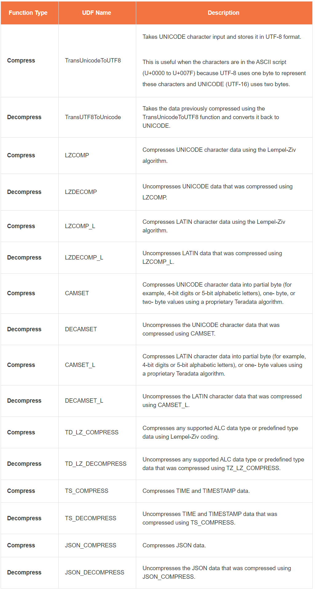
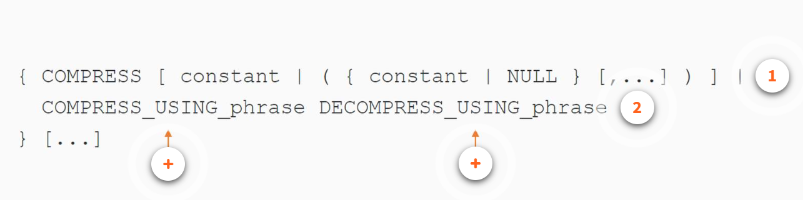
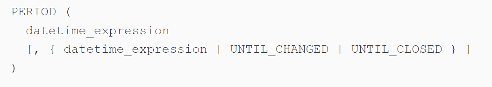
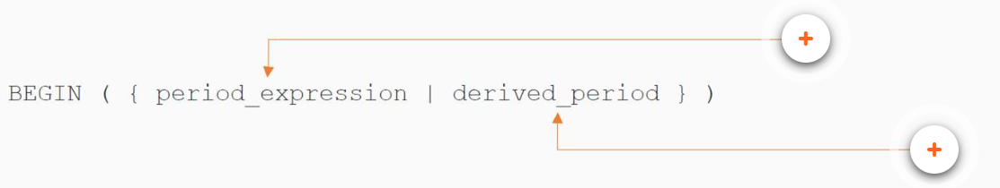
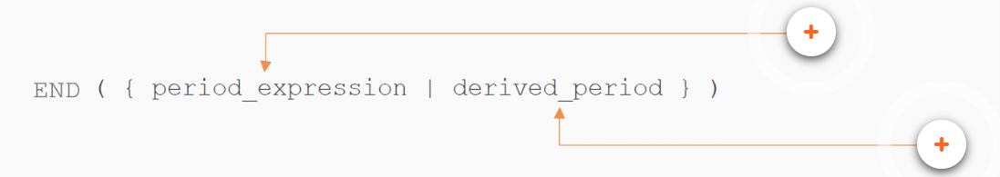
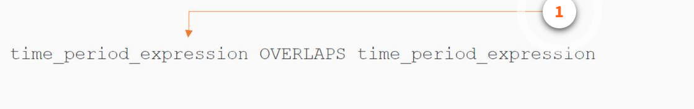
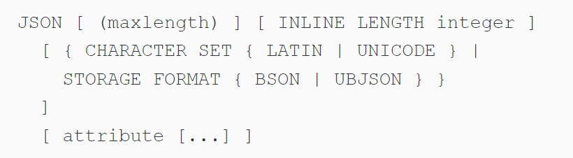

  

 

# Teradata Vantage Data Engineering: SQL Part 1 (TDVAN4)
## Module 1 *Character Data Type*

### Create a set table in db named pd
CREATE SET TABLE pd.employee
{   
    EmpNo INTEGER NOT NULL,
    DeptNo INTEGER,
    CASESPECIFIC,
    FirstName VARCHAR(20) CHARACTER SET LATIN NOT CASESPECIFIC,
    Gender CHARACTER NOT NULL CHARACTER SET LATIN NOT CASESPECIFIC
    SalaryAmount DECIMAL(10,2),
    Employee_Feedback CLOB(2M)   
}
UNIQUE PRIMARY INDEX (EmpNo);

***

* **CHAR** type **enforce fixed length**
* CHAR(20) means lastname is **always 20 characters** and use **20 bytes** of storage
* **VARCHAR** is used for columns where we **don’t want to enforce fixed length**
* **A Character Large OBject (CLOB)** column can store large character data such as simple text or HTML (Kilobytes; Megabytes; Gigabytes). It has a **fixed length** up to 2GB in size.

**CHAR** uses a fixed length and hence there could be storage wastage if there is a great variance in the value length. On the other hand, if the variance in value length is minimum, CHAR can be preferred as they don’t take extra 2 bytes overhead unlike VARCHAR. 

Although **VARCHAR** uses only required storage depending on the value length, they take 2 bytes overhead to store the actual length of the data. They are preferred types over CHAR as we save space. However, they are good for values where there is a great variance in their length, so we get the benefit of space saving. For VARCHAR leading and trailing spaces are also counted.

* A table can have a maximum of 32 LOB columns
* Queue tables cannot have CLOB columns
* A LOB column cannot be a component of an index;.because of this restriction, a table must define at least one non-LOB column
* The CHARACTER SET clause can specify the following server character sets for a CLOB column: LATIN and UNICODE.
***
## Module 2 *Date and Time Type*]
### DATE
**You can specify dates in SQL statements in three ways:**
* **String**: 'Jan 31 1948'
* **Number**: 1011220  (means 2001-12-20) 
* **ANSI date Literal**: DATE '2001-12-20'
**Can re-format the date value by put a FORMAT 'form'**
### TIME
Teradata Vantage performs **implicit conversion** from **CHARACTER** to **TIME** types during assignment and comparison. This conversion is **supported for CHAR and VARCHAR types only.** You **cannot** convert a character data type of CLOB or CHAR/VARCHAR CHARACTER SET GRAPHIC to TIME.
### TIMESTAMP
Conceptually, **TIMESTAMP** is treated as a record composed of six or eight WITH TIME ZONE fields, defined appropriately for the Gregorian calendar.

Teradata Vantage performs **implicit conversion** from **CHARACTER** to **TIMESTAMP** types during assignment and comparison. This conversion is **supported for CHAR and VARCHAR types only.** You cannot convert a character data type of CLOB or CHAR/VARCHAR CHARACTER SET GRAPHIC to TIMESTAMP.
**The DAY (4) specifies four digits of precision and allows for a maximum of 9999 days, or approximately 27 years.**
***
## Module 3 *Column Level Type*
**You can specify the following optional column attributes:** 
* Data type attribute declaration (**UPPERCASE, [NOT] CASESPECIFIC, WITH TIME ZONE**)
* Column nullability (**NOT NULL**) 
* Multivalue and algorithmic compression (**COMPRESS**)
* Column storage attributes (**COMPRESS, CHARACTER SET**)
* Output format attributes (**FORMAT, TITLE, NAMED, AS**) Default value attributes (**DEFAULT or WITH DEFAULT**) 
* Column constraint attributes
  * **PRIMARY KEY** constraint definition
  * **UNIQUE** constraint definition
  * **FOREIGN KEY** ... REFERENCES constraint definition
  * **CHECK** constraint definition
  * **Row-level** security constraint assignments

### FORMAT
**You can override the default format with the FORMAT phrase of a CREATE TABLE, ALTER TABLE, SELECT, UPDATE, DELETE, MERGE, or INSERT statement.  FORMAT does not control the internal storage representation of data or data returned in record or indicator variable mode.**
**Rules**
* A FORMAT specification can contain a **maximum of 30 characters**
* A FORMAT phrase can **describe up to 18- digit positions** (17 if the FORMAT contains an E). IEEE 64-bit floating numbers are accurate to about 15 digits
* The output string that is produced as a result of a FORMAT phrase **can have a maximum of 255 characters**
* If you specify a FORMAT phrase to define the format for **UDT** columns, the format **must be valid for the external type of the UDT**, as specified by the transform that defines how to pass the UDT between the application and the server

### DEFAULT
**DEFAULT** specifies that a **user-defined default value** is to be **inserted** in the field when a value is not specified for a column in an INSERT statement. DEFAULT is ANSI SQL:2011 compliant. 

### CASESPECIFIC
**CASESPECIFIC** attributes specify the case for character data comparison and collations. In Vantage, **‘AAA’ and ‘aaa’ are treated as equal as default.**

**Rules: All Modes**
* CASESPECIFIC specifies that **comparisons are case-specific**
* NOT CASESPECIFIC specifies that comparisons are not case-specific
* If neither CASESPECIFIC nor NOT CASESPECIFIC is specified as part of the column definition, then you can specify the option in an SQL request to ensure that the statement behaves as intended; by **including an explicit CASESPECIFIC (or CS) qualifier** in your SQL statement, you override the case specificity for a column
* A column typed as **CHAR or VARCHAR CHARACTER SET GRAPHIC** defaults to **CASESPECIFIC** when it is created
* **CLOBs and UDTs** data types **do not support** CASESPECIFIC or NOT CASESPECIFIC
* Character data is stored as typed unless the UPPERCASE phrase is specified

### COMPRESS
**Compression** reduces the **physical size** of stored information. The goal of compression is to **represent information accurately** using the **fewest number of bits**. Compression methods are either **logical** or **physical**. Physical data compression **re-encodes** information independently of its meaning, while **logical data** compression substitutes **one set of data with another, more compact set.**
* **To reduce storage costs**: By storing more logical data per unit of physical capacity. Compression **produces smaller rows**, resulting in more rows stored per data block and fewer data blocks.
* **TO enhance system**: There is **less physical data to retrieve** per row for queries; also, because compressed data **remains compressed** while in memory, the FSG cache can hold more rows, reducing the size of disk I/O.
  
#### Types of Compression
* **Multivalue Compression & Algorithmic Compression: column values**
  * Compression refers to the **storage of those values one time only** in the **table header**, **not in the row itself**, and pointing to them using an array of presence bits in the row header
  * You **cannot** apply either multivalue compression or algorithmic compression to row-level security constraint columns
  * **You can compress data at the column level using multi-value compression, a lossless, dictionary-based compression scheme**
  * **You can use MVC to compress columns with these data types:** 
    * Any numeric data type 
    * BYTE 
    * VARBYTE 
    * CHARACTER 
    * VARCHAR 
    * DATE: must specify the value as a **Date literal** using the ANSI DATE format (DATE 'YYYY-MM-DD').
    * TIME and TIME WITH TIME ZONE
    * TIMESTAMP and TIMESTAMP WITH TIME ZONE: must specify the value as a **TIME or TIMESTAMP literal**. 
    * use COMPRESS (NULL) for columns with these data types:
      * ARRAY
      * Period
      * Non-LOB distinct or structured UDT
  * **Rules**
    * The **maximum number of distinct** constant values in the list is **255 plus NULL**
    * Values can appear in **any order**
    * **NULL** can appear at any point in the multi-valued constant list
    * The multi-value list **cannot** contain **duplicate values**. Note that case variants are not considered duplicate values if UPPERCASE is not specified
    * NULL **cannot** appear in the list if the column is **declared NOT NULL**
* **Row Compression: hash and join indexes**
  * Compression refers to a logical row compression in which multiple sets of **non-repeating column values** are appended to a single set of repeating column values. 
  * **You can use algorithmic compression to compress table columns with the following data types:**
    * ARRAY 
    * BYTE 
    * VARBYTE 
    * BLOB 
    * CHARACTER 
    * VARCHAR
    * CLOB
    * JSON, with **some restrictions** listed below 
      * TIME and TIME WITH TIME ZONE 
      * TIMESTAMP and TIMESTAMP WITH TIME ZONE 
      * Period types 
      * Distinct UDTs, with some restrictions listed below 
      * System-defined UDTs, with some restrictions listed below
  

  * **Restrictions**
    *  You **cannot** use ALC to compress columns that have a data type of structured UDT 
    *  The TD_LZ_COMPRESS and TD_LZ_DECOMPRESS system functions compress **all large UDTs** including UDT-based system types such as Geospatial, XML, and JSON. However, if you write your own compression functions, the following **restrictions** apply: 
       *  Custom compression functions **cannot be used** to compress **UDT-based system types** (except for ARRAY and Period types)
       *  Custom compression functions **cannot be used** to compress **distinct UDTs** that are based on UDT-based system types (except for ARRAY and Period types)
    *  You **cannot write** your own compression functions to perform **algorithmic compression on JSON type columns**; however, Teradata provides the **JSON_COMPRESS** and **JSON_DECOMPRESS** functions that you can use to perform ALC on JSON type columns
    *  You cannot use ALC to compress **temporal columns**: 
       *  A column defined as **SYSTEM_TIME, VALIDTIME, or TRANSACTIONTIME**
       *  The DateTime columns that define the **beginning and ending** bounds of a temporal derived period column (**SYSTEM_TIME, VALIDTIME, or TRANSACTIONTIME**)
    *  You **can** use ALC to compress period data types in columns that are **nontemporal**; however, you **cannot use** ALC to compress **derived period columns**.
       *  You **cannot specify** multi-value or algorithmic compression for a **row-level** security constraint column
       *  You can specify ALC alone, or both MVC and ALC **on the same column.** (If you define both on the same column, ALC is applied **only** to those non-null values that are not specified in the value compression list of the MVC specification
* **Block Level Compression: data blocks**
  * Compression refers to the storage of **primary table data**, or join or hash index subtable data. **Secondary Index (SI)** subtable data **cannot** be compressed. 
* **Auto Compression: partition containers**
  * Compression refers to the **auto-compression method** set determined by Teradata Vantage to apply to a **container of a column-partitioned table** or **join index** when you have not specified the NO AUTO COMPRESS option at the time the object was created.
* **COMPRESS With No Arguments** 
  * Compress **nulls** only
  * Note that if you **do not specify** COMPRESS, nulls are not automatically compressed
### Syntax 

* **COMPRESS**: Compress column data using multivalue compression. 
* **constant**: A set of values to be compressed. You can specify a single constant value, or a multivalued, comma-separated list of **up to 255 distinct constant values** enclosed in parentheses.
* **NULL**: 
  * Nulls will be compressed
  * NULL can be specified alone, but it must be enclosed in parentheses. (This is the **same as** specifying COMPRESS without an argument.) 
  * NULL can be specified with up to 255 constant values in a multivalued, comma-separated list enclosed in parentheses
* **COMPRESS USING**: Compress column data using algorithmic compression.
* **DECOMPRESS USING**: Decompress column data that was previously compressed using algorithmic compression.
* **dbname**: The **name of the database** in which the compressed or decompressed user-defined function (UDF) is stored. If a database name is not specified, the default database used is SYSUDTLIB.
* **compress_udf**: The name of the UDF used to compress values in the column.
* **decompress_udf**: The name of the UDF is used to decompress values in the column.
***
## Module 4 *Period Data Type*
**A Period is an anchored duration. It represents a set of contiguous time granules within that duration.** It has a **beginning** bound (defined by the value of a beginning element) and an **ending** bound (defined by the value of an ending element). The representation of the period is **inclusive-exclusive;** that is, the period extends from the beginning bound up to but not including the ending bound. 

### Result Value 

The following rules apply to the result value: 

* If the beginning **or** ending bound is **NULL**, or both the bounds are NULL, the result is NULL
* If the beginning **and** ending bounds are **NULL** or if the beginning bound is **NULL** **and** the ending bound is **UNTIL_CHANGED**, then the type of the period defaults to **PERIOD(TIMESTAMP(0))**
* If **only the beginning** bound is specified, the **result ending bound is the beginning bound plus one granule of the result element type**
  * If the result ending bound **exceeds** or becomes equal to the maximum allowed DATE or TIMESTAMP value for the result data type of PERIOD(DATE) or PERIOD(TIMESTAMP(n) [WITH TIME ZONE]), respectively, **an error is reported**
* If an **ending bound** is specified as a value expression and the beginning bound and ending bound **have different precisions**, the **result precision is the higher of the two precisions; otherwise, the result precision is the precision of the beginning bound**
* **UNTIL_CHANGED sets the result ending element to a maximum DATE or TIMESTAMP value depending on the data type of the beginning bound.** If the data type of the beginning bound is TIMESTAMP(n) WITH TIME ZONE, the result ending element is set to the maximum TIMESTAMP(n) WITH TIME ZONE value at UTC (that is, the time zone displacement for the ending bound is INTERVAL '00:00' HOUR TO MINUTE)
* If the beginning bound or the ending bound or the beginning and ending bounds **include a time zone value**, and the **ending bound is not UNTIL_CHANGED**, the result data type is **WITH TIME ZONE** 
  * If **only one** of the bounds includes a time zone value, the time zone field of the **other is set to** the current session time zone displacement 
  * If **both** bounds include time zone values, the **result** bounds include the corresponding time zone value
* The result Period data type has **an element type that is the same as the DateTime** data type of the beginning bound **except** with the precision and time zone as defined previously
* The handling of **leap seconds** for Period data types with TIME and TIMESTAMP element types is as follows: If the value for the beginning **or** ending bound contains **leap seconds**, the **second portion gets adjusted** to **59.999999** with the precision truncated to the result precision. During this process, if the beginning and ending bounds are the same, **an error is reported**

### Usage Rules 
The following rules apply to the Period value constructor: 
* The beginning bound must have a **DateTime** data type and, if an ending bound is specified, the data types of the beginning and ending bounds must be **comparable**
* The **ending bound** where the data type of the beginning bound is DATE or TIMESTAMP can be set to UNTIL_CHANGED
* If the ending bound is set to UNTIL_CLOSED, the following must be true: 
  * The data type of the beginning bound value must be **comparable** with TIMESTAMP(6) WITH TIME ZONE
  * The constructor is **only valid in an assignment operation** where the target column to which the result is **assigned is a transaction-time** column
  * Because the only way to set the value of a transaction-time column is by using **nontemporal DML**, the constructor is only valid in a nontemporal DML statement
* Teradata Vantage **reports an error** if any of the following are true: 
  * **UNTIL_CHANGED is specified for the beginning bound** 
  * **UNTIL_CLOSED is specified for the beginning bound**
  * The result **beginning** bound is **greater** than or equal to the result ending bound
  * The **data types** of the beginning and ending bounds are not **comparable**
  * **UNTIL_CHANGED** is specified for the ending bound and the data type of the beginning bound is **TIME(n) [WITH TIME ZONE]**
#### Syntax

* **datetime_expression**: An expression that evaluates to a **DATE, TIME, or TIMESTAMP value. **
* **UNTIL_CHANGED**: A **DATE or TIMESTAMP value** that is considered to be forever or until it is changed. UNTIL_CHANGED has a data type of Date or Timestamp.
* **UNTIL_CLOSED**: An ending bound for the Period value of a **temporal table** transaction-time column that indicates that the row is an open row.
#### Size of PERIOD Data Type in bytes
* PERIOD(DATE) 8
* PERIOD(TIME(n)) 12
* PERIOD(TIME(n) WITH TIME ZONE) 16
* PERIOD(TIMESTAMP(n)) 20
* PERIOD(TIMESTAMP(n) WITH TIME ZONE) 24

#### Restrictions
##### The following data type attributes are **supported** for a PERIOD column: 
* NULL and NOT NULL 
* FORMAT 'format string' 
* TITLE 
* NAMED 
* DEFAULT NULL 
* DEFAULT value 
* WITH DEFAULT  *Only for PERIOD(DATE) and PERIOD(TIMESTAMP [WITH TIME ZONE])  

##### The following data type attributes are not supported for a PERIOD column: 
* DEFAULT USER 
* DEFAULT DATE 
* DEFAULT TIME 
* DEFAULT CURRENT_DATE 
* DEFAULT CURRENT_TIME[(n)] 
* DEFAULT CURRENT_TIMESTAMP[(n)] 
* UPPERCASE or UC 
* CASE_SPECIFIC or CS 
* CHARACTER SET 
* WITH DEFAULT Only for PERIOD(TIME [WITH TIME ZONE])
  
**A primary index column or partitioning column cannot be a column that has a Period data type.**

### BEGIN

**Return Value**: The result data type of the BEGIN function is same as the element type of the Period expression or the data type of the begin column if the argument is a derived period column. If the argument is NULL, the result is NULL. 

**Error Conditions**: If the argument does not have a Period data type, an error is reported.

### END

**Return Value**: The result data type of the END function is the same as the element type of the Period expression or the data type of the end column if the argument is a derived period column. If the argument is NULL, the result is NULL. 

### OVERLAP

#### Rules 
* When you specify **two DateTime types**, they must be **comparable**
* When you specify **two Period types**, including derived periods, they must be **comparable**
* If you specify **a Period type for either one or both time periods**, the Period expression must **not include an explicit NULL**
* If the **first columns** of each left and right time period are **DateTime** types, they must have the **same data type**: both DATE, both TIME, or both TIMESTAMP 
* If **only one** time period is a **Period type**, the first column of the other time period must have the **same data type** as the element type of the Period
* If **neither** time period is a Period type, then the second column of each left and right time period must either be the same DateTime type as its corresponding first column or it must be an Interval type that involves onlyDateTime fields where the precision is such that its value can be added to that of the corresponding DateTime type
**Error Conditions**: If an argument of any data type other than a Period data type is passed to the function, an error is reported.

### LDIFF
**Returns the portion of the first Period expression that exists before the beginning of the second Period expression when the Period expressions overlap.**

When the Period expressions overlap but there is **no portion** of the first Period expression before the beginning of the second Period expression or the Period expressions do not overlap, the function returns NULL. If either Period expression is NULL, LDIFF returns NULL.
### RDIFF
**Returns the portion of the first Period expression that exists from the end of the second Period expression when the Period expressions overlap.** 

When the Period expressions overlap but there is no portion of the first Period expression from the end of the second Period expression or if the Period expressions do not overlap, RDIFF returns NULL. If either Period expression is NULL, RDIFF returns NULL. 
### IS UNTIL_CHANGED and IS NOT UNTIL_CHANGED
***
## Module 5 *JSON Data Type*
**JSON (Javascript Object Notation)** is a **text-based, data interchange** format, often used in web applications to transmit data. JSON has been widely adopted by web application developers because compared to XML it is easier to read and write for humans and easier to parse and generate for machines. JSON documents **can be stored and processed in Teradata Vantage.**
* JSON data type content is **stored in an optimized format** depending on the **size** of the data
* The user is **not responsible** for executing the CREATE TYPE statement for the JSON data type. JSON data types **do not need** to be created via **DDL** by the user as the JSON data type exists in the database
* The JSON data type **cannot be created, dropped, or altered** by the user
* There are **two points of commonality** between all uses of the JSON data type in any valid location:
  * The **maximum length** of any instance of the JSON data type is variable
  * You may **set the maximum length** of the JSON instance, otherwise the **default** maximum length is used
* The **CHARACTER SET** for the text of the JSON data type can be either **UNICODE or LATIN** (If you do not specify the character set, the default character set of the user is used)

### Restrictions for the JSON Type 
* You **cannot specify** the JSON type in the following situations:
  * As the **base type of a distinct UDT**
  * As the **element type of an ARRAY type**
* You **cannot** create methods for the JSON type; therefore, you cannot specify a JSON type name in the FOR clause of a **CREATE/REPLACE METHOD** statement
* You **cannot** specify a JSON type column as part of **an index**, although a non-LOB JSON type can be part of a join index in some cases
* You **cannot** use JSON type columns in **clauses that depend on ordering** or **comparison**, such as ORDER BY, GROUP BY, or HAVING
* You **cannot update the entities** of a JSON instance; therefore, you cannot use JSON dot notation in the target portion of a SET clause
* Although the external representation of JSON values is of the character string type, **string operations are not allowed directly on the JSON values.** JSON can be **serialized or cast** to generate a string representation before you apply the string operation
* **Extracted** JSON values **can** be used in **arithmetic expressions**. You can cast the extracted JSON value to the appropriate SQL type to perform the computation
* **Extracted** JSON values **can** be used in **relational comparison operations** (such as >, <, or =). You can cast the extracted JSON value to the appropriate SQL type to perform the comparison
* JSON type columns **cannot** do the following.
  * Occur in **queue tables**
  * Participate in **joins**; however, portions of the JSON column can be joined and JSON columns can be in the SELECT list

### Syntax

* **maxlength**
  * A **positive integer value** is followed by an optional multiplier. maxlength specifies the maximum length of the JSON type as follows:
    * If the storage format of the JSON type is **text**, the maximum length is in characters
      * If you **do not specify** a maximum length, the default maximum length for the character set is used
      * If **specified**, the length is subject to a minimum of two characters and cannot be greater than the maximum of **16776192 LATIN** characters or **8388096 UNICODE** characters)
  * If the storage format is **BSON or UBJSON**, the maximum length is **in bytes.** If you do not specify a maximum length, the default maximum length of **16776192 bytes** is used
  * The multiplier, if specified, is **KkMm**
 * The length specified **only covers the actual data length**. The actual storage sizes include additional header information.
* **INLINE LENGTH integer**
  * A **positive integer** value that specifies the **inline storage size**. Data that is smaller than or equal to the inline storage size is stored inside the **base row**; otherwise, it is stored in a **LOB subtable**
  * The inline length **cannot** be larger than maxlength
* **CHARACTER SET**
  * The character set for the JSON type can be **LATIN or UNICODE**
  * If you **do not specify** a character set, the default character set for the user is used
  * You **cannot** specify the CHARACTER SET together with the STORAGE FORMAT clause
* **STORAGE FORMAT**
  * Specifies that the **storage format** of the JSON type will be one of the following binary formats
    * **BSON (Binary JSON)**
    * **UBJSON (Universal Binary JSON)**
  * If you **do not specify** a storage format, the default storage format is text in the character set specified (or the default character set)
  * You **cannot** specify STORAGE FORMAT together with the CHARACTER SET clause
* **attribute**
  * NULL and NOT NULL
  * FORMAT
  * TITLE
  * NAMED
  * DEFAULT NULL
  * COMPRESS USING and DECOMPRESS USING

### JSON Data
**What the JSON data looks like.**
* A JSON string consists of **combinations** of objects and arrays
* **Objects** are contained in braces **{ }**, **arrays** are contained in brackets **[ ]**
* **Objects** **may reside** within arrays or other objects
* **Arrays** **may reside within** objects or other arrays
* **{ "status" : "Normal", "PSI" : 29.5 , "location" : "LF" }**

When **inserting** a JSON type into a column or using the JSON type as an argument to a function or method, you can **pass in a string** of any size as long as it is less than or equal to the maximum possible length of the resulting JSON type, which is **16776192 LATIN characters or 8388096 UNICODE characters.** If the data being inserted is **longer than** the maximum length specified for a particular JSON instance, **an error** is reported.

#### Rules for JSON Data
1. JSON allows **Unicode** characters to be embedded in their **hexadecimal** formats in a character string using the **'\u'** string as an escape sequence. This is allowed within the JSON type, but the **'\u' hex** Unicode character is **not interpreted**; it is merely stored as is.
2. **White space outside the root** of the JSON object or array is **trimmed** for all instances of the JSON type, as well as **white space characters within the root** of the JSON object or array are **considered significant and are not removed.**
3. There is a **maximum limit of nesting** imposed on a JSON instance. The default is **512**. The limit is configurable up to **a maximum of 32000** using the JSON_MaxDepth DBS Control Field, a nested object or array counts against this limit.
4. You can specify **exponential numbers** using scientific notation and the range of valid numbers is between **-1e308 and 1e308, noninclusive.** Exponents can have a **value** between **-308 and 308, noninclusive.** Any number or exponent specified **outside of the valid range**, whether explicitly stated or understood to be outside of that range based on the value of the mantissa, **will result in an error.**

#### Compressing JSON Type Data
You can use the following compression functions to perform **algorithmic compression (ALC) on JSON type columns**:
* JSON_COMPRESS
* JSON_DECOMPRESS
* TD_LZ_COMPRESS
* TD_LZ_DECOMPRESS
You can use TD_LZ_COMPRESS to compress JSON data; however, Teradata recommends that you use **JSON_COMPRESS instead** because the JSON_COMPRESS function is **optimized** for compressing JSON data.
* Rules
  1. **JSON_COMPRESS and JSON_DECOMPRESS** can be used to compress JSON type columns **only**. These functions **cannot** be used to compress columns of other data types
  2. You **cannot** create **your own** compression and decompression user-defined functions to **perform algorithmic compression** on JSON type columns. (You must use the functions previously listed.)
  3. You **can use** ALC to compress columns that store JSON data using one of the binary storage formats (**BSON or UBJSON**)
#### Loading JSON Data Using Load Utilities
**Loading JSON data is the same as loading LOB or XML data,** and you use the **"JSON" keyword** in the load script to define the column type. Like LOB data, you can load in **inline mode** if the data is **less than 64 KB** in size (64000 LATIN characters or 32000 UNICODE characters). Otherwise, you must specify the column as **"JSON AS DEFERRED BY NAME"** (with the data residing in external files), where the client and Vantage make multiple calls to move the data.

You can use the following **load utilities** for loading and unloading JSON data:
* The **Teradata Parallel Transporter** (Teradata PT) SQL Inserter operator supports the loading of JSON data into a table
* The **Teradata PT SQL Selector** operator supports the unloading of JSON data from a table
* The **Teradata PT Data Connector** operator supports the writing and reading of JSON data to and from a file.
***
## Quiz

  

